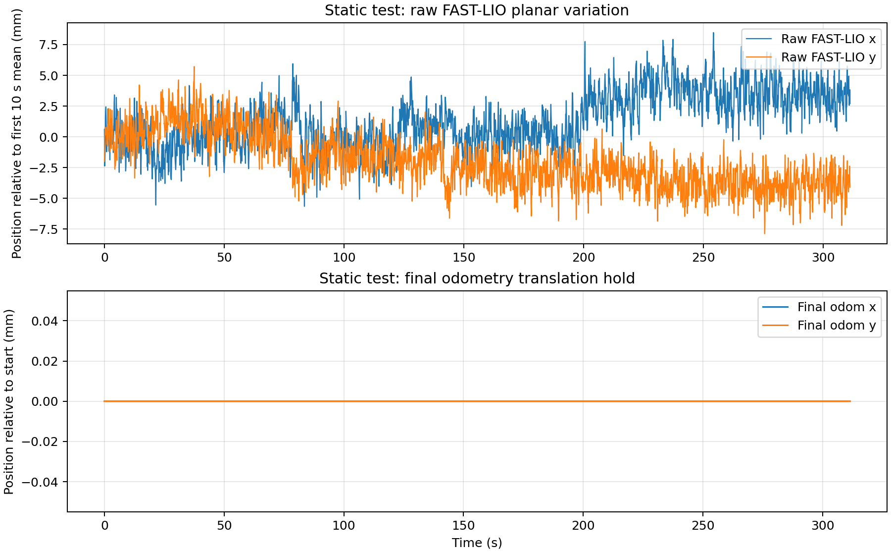
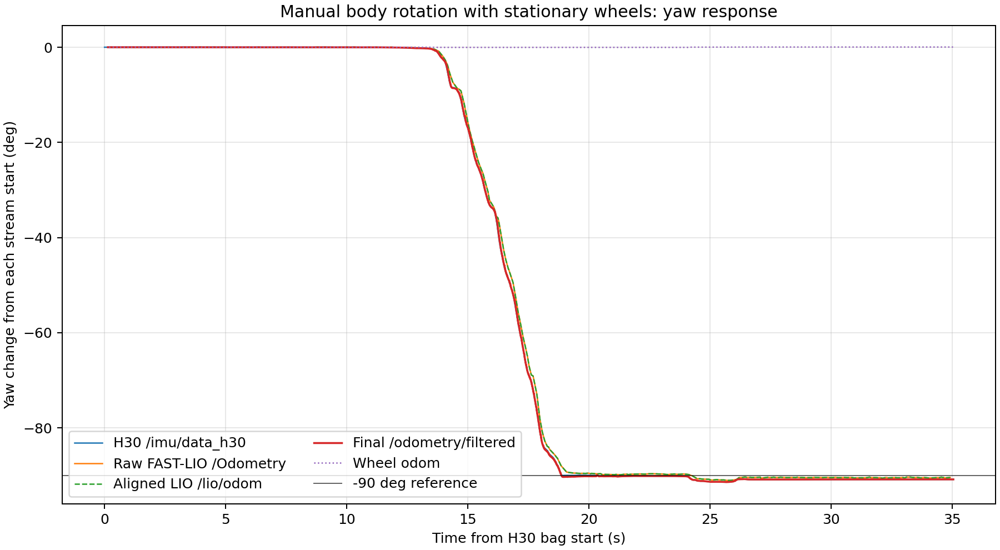
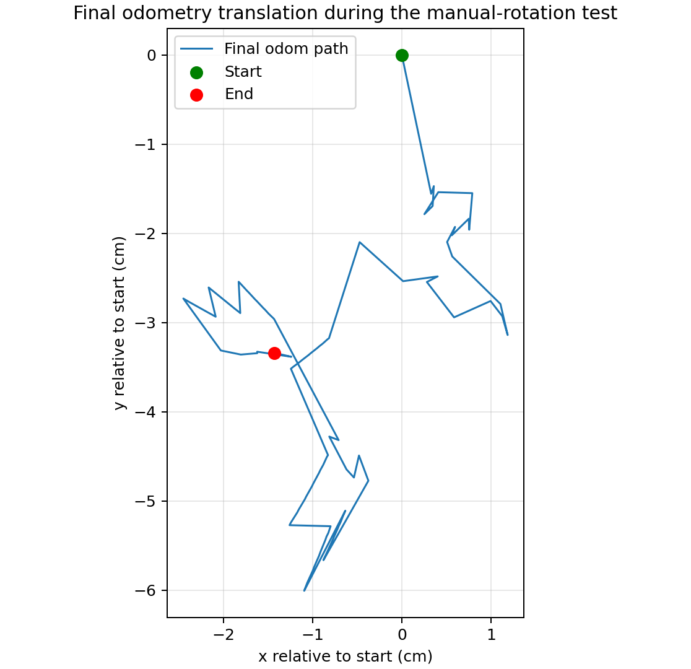
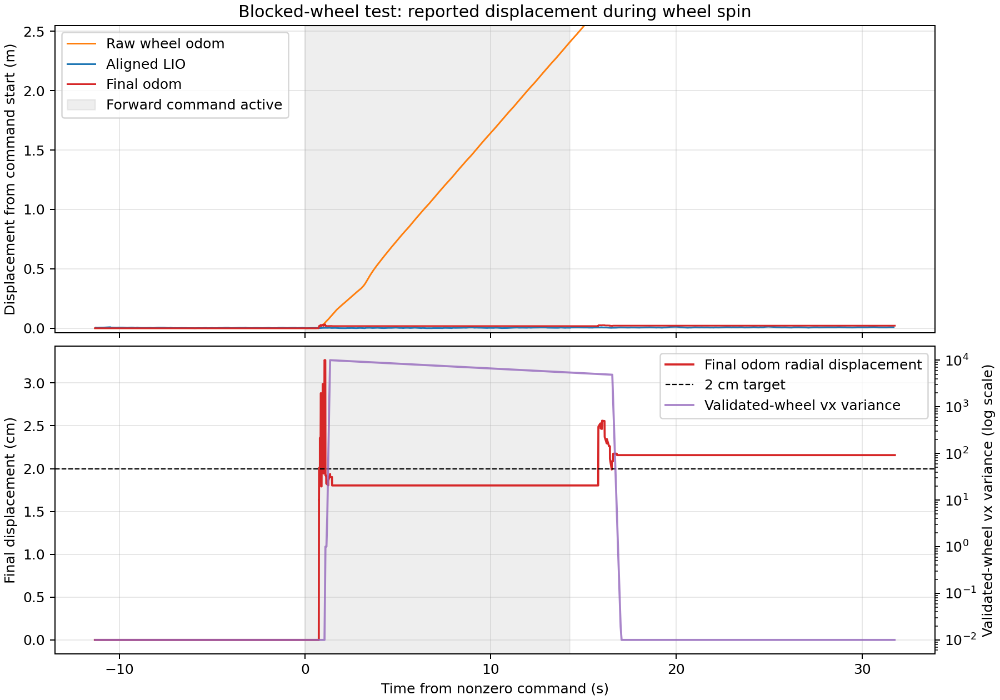
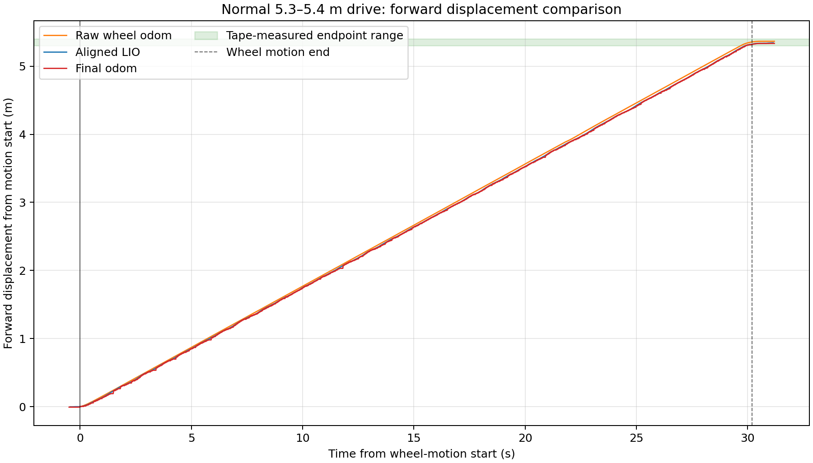

# 基于 FAST-LIO 与 H30 的抗打滑里程计实验报告

## 1. 实验目的

验证改进后的最终里程计 `/odometry/filtered` 在以下四类情况下的行为：

1. 车辆静止时，不因 FAST-LIO 的小幅点云匹配波动而出现平移抖动或累计漂移；
2. 轮子不转、轮速里程计近似为零，但车体被外力转动时，最终航向仍能实时跟随车体真实转动。
3. 车体被障碍物顶住、轮子持续空转时，最终位置不会随轮速持续累计；
4. 正常直线行驶时，轮速能够提供高频响应，LIO 持续约束最终位移精度。

本报告只基于已录制 rosbag 的消息数据计算。除特别说明外，时间均使用 ROS 消息头时间戳，位置、航向均来自相应 `nav_msgs/Odometry` 或 `sensor_msgs/Imu` 消息。

## 2. 被测系统与数据来源

系统的数据流如下：

```text
MID360 + 内置IMU -> FAST-LIO (/Odometry) -> slip_aware_odometry (/lio/odom)
H30 IMU ---------> EKF 内部融合 (/odometry/fused_internal)
轮式里程计 ------> 经过可信度处理的 /wheel/odom_validated
                                             |
                                             v
                            /odometry/filtered 与 odom -> base_footprint
```

本次使用的录包：

| 编号 | rosbag | 时长 | 实验操作 |
|---|---|---:|---|
| T01 | [h30_test_01_static_fastlio](/home/wheeltec/agribot/agribot_ws/h30_test_01_static_fastlio) | 311.46 s | 小车全程静止 |
| T02 | [h30_test_02_turn_90_fastlio](/home/wheeltec/agribot/agribot_ws/h30_test_02_turn_90_fastlio) | 35.05 s | **直接用手转动车体约 90°，不是由轮子驱动转向** |
| T03 | [h30_test_03_blocked_wheel_spin_fastlio](/home/wheeltec/agribot/agribot_ws/h30_test_03_blocked_wheel_spin_fastlio) | 43.23 s | 车体顶住障碍物，给出前进指令并使轮子空转 |
| T04 | [h30_test_04_normal_forward_fastlio](/home/wheeltec/agribot/agribot_ws/h30_test_04_normal_forward_fastlio) | 53.87 s | 正常直线行驶；卷尺实测距离约 5.3–5.4 m |

T02 未录制 `/cmd_vel`，因此不能从本包计算“控制指令到 odom 输出”的绝对响应延迟；本报告只评价各传感器流之间的时间关系与运动一致性。

## 3. 指标定义

| 指标 | 计算方式 | 用途 |
|---|---|---|
| 首尾漂移 | 末段 10 s 均值减首段 10 s 均值 | 评价静止时的长期偏移 |
| 峰峰值 | 全程最大值减最小值 | 评价噪声/抖动范围 |
| 净位移 | 起点和终点位置的欧氏距离 | 描述转前转后的位置变化 |
| 轨迹长度 | 连续位置点距离之和 | 描述输出位置曲线的总变化量，不能等同于人工操作的真实路径 |
| LIO 接收延迟 | rosbag 接收时间减消息头时间 | 评价 FAST-LIO 结果到达 ROS 的时延 |

## 4. T01：静止抗抖测试

### 4.1 数据统计

| 项目 | 结果 |
|---|---:|
| H30 `/imu/data_h30` 频率 | 200.00 Hz |
| 原始 FAST-LIO `/Odometry` 频率 | 9.56 Hz |
| 最终 `/odometry/filtered` 实际频率 | 128.95 Hz |
| 原始 FAST-LIO X 峰峰值 | 14.12 mm |
| 原始 FAST-LIO Y 峰峰值 | 13.59 mm |
| 原始 FAST-LIO 平移首尾漂移 | 4.94 mm |
| 原始 FAST-LIO 最大径向偏离 | 9.73 mm |
| 最终 odom X/Y 首尾漂移 | **0 mm** |
| 最终 odom X/Y 峰峰值 | **0 mm** |
| H30 航向首尾变化 | +0.013° |
| H30 航向峰峰值 | 0.065° |
| LIO 超过 0.5 s 的更新间隔 | 0 次 |

最终 odom 的实际频率高于配置的 50 Hz，是因为最终发布同时受定时器、轮速回调、LIO 回调和 EKF 回调触发；它不表示存在多个最终 odom 发布者。

### 4.2 曲线



图 1 上半部分可见原始 FAST-LIO 在毫米至厘米量级波动；下半部分表明静止保持机制启用后，最终 `/odometry/filtered` 的 X、Y 保持为常数。

### 4.3 结论

T01 通过。系统没有把原始 LIO 静止噪声直接暴露给导航与 TF；静止时最终位置不会发生可见的平移抖动或持续累计。

## 5. T02：手动转动车体约 90°、轮速为零

### 5.1 实验条件与边界

本实验中，车体由人工直接转动，轮子没有通过底盘控制驱动旋转。因此轮速里程计接近零是预期现象，而不是轮速传感器故障。

该实验验证“轮速未反映真实车体角运动时，最终航向是否仍正确”；它**不**能替代“顶住障碍物后轮子空转”的平移抗打滑测试，也不能作为严格的原地旋转平移误差标定，因为手动转动的旋转中心和微小推移没有地面真值。

### 5.2 数据统计

| 项目 | H30 | 原始 FAST-LIO | 对齐 LIO `/lio/odom` | 最终 `/odometry/filtered` | 轮速 odom |
|---|---:|---:|---:|---:|---:|
| 航向首尾变化 | -90.845° | -90.414° | -90.412° | -90.830° | +0.041° |
| 航向全程范围 | 91.414° | 91.080° | 91.079° | 91.402° | 0.078° |
| 消息频率 | 200.00 Hz | 9.50 Hz | 9.50 Hz | 128.58 Hz | 20.00 Hz |
| 最大平面速度 | — | 0.096 m/s | 0.093 m/s | 0.093 m/s | 0.002 m/s |

其它时序指标：

| 指标 | 结果 |
|---|---:|
| 最终 odom 达到 -1° 的时刻 | 录包后约 17.33 s |
| 最终 odom 达到 -90° 的时刻 | 录包后约 22.45 s |
| 约 90° 转动持续时间 | 约 5.12 s |
| H30 与最终航向的最佳时间配准差 | 约 9.5 ms |
| H30 与最终航向动态残差标准差 | 0.155° |
| FAST-LIO 消息接收延迟：均值 / P95 / 最大值 | 45.8 / 65.6 / 93.1 ms |
| 最终 odom 转前转后净位移 | 3.63 cm |
| 最终 odom 样本轨迹长度 | 21.8 cm |

“最佳时间配准差”是两条已记录航向曲线在时间轴上的最小误差匹配结果，不是从控制指令测得的闭环延迟。

### 5.3 航向曲线



图 2 中紫色虚线的轮速航向始终接近 0°；H30、FAST-LIO 和最终 odom 均检测到了约 -90° 的车体转动。最终 odom（红色）紧跟 H30（蓝色），而不是等待 10 Hz FAST-LIO 的位置修正才改变航向。

### 5.4 平移输出曲线



图 3 仅描述最终 odom 的输出变化，不应被解释为真实地面轨迹。手动转车时，旋转中心不一定是 `base_footprint` 原点；轮胎与地面的微滑、手扶位置以及 LIO 匹配噪声都会造成图中的厘米级平移变化。若要评价严格原地旋转的平移误差，应使用转台或在地面标记并固定 `base_footprint` 的旋转中心。

### 5.5 轮速可信度现象

`/wheel/odom_validated` 的位姿协方差固定为 `1e6` 是当前 EKF 配置的设计：轮速只向 EKF 提供平面速度，不提供绝对位姿。因此应检查速度协方差，而不能仅凭位姿协方差判断轮速被隔离。

本包中，666 条验证后轮速消息里：

| 轮速速度协方差状态 | 消息数 | 现象 |
|---|---:|---|
| 正常方差（vx/vy = 0.01） | 652 | 正常权重 |
| 瞬时降权 | 14 | 约在人工转动中短暂发生 |
| 持续完全隔离（方差约 `1e6`） | 0 | 未进入持续拒绝状态 |

这次没有持续隔离不会影响航向结果，因为 EKF 配置本就不融合轮速 yaw，最终航向由 H30 提供。但它暴露出一个后续改进点：当前窗口状态机主要以平移位移是否超过门限判断“可观测运动”；对于几乎纯旋转的情况，应将 H30/FAST-LIO 的角速度或航向变化也纳入可观测条件，使轮速与真实航向明显不一致时能稳定进入隔离状态。

### 5.6 结论

T02 的航向验证通过：在轮速近似为零、车体被外力转动约 90° 时，最终 `/odometry/filtered` 输出约 -90.83°，与 H30 的 -90.85° 一致，且没有出现等待数秒后才修正的现象。

## 6. T03：顶住障碍物、轮子持续空转

### 6.1 实验条件

前进指令速度为 `0.1806 m/s`，非零指令持续 `14.24 s`。车体被障碍物限制而不能前进，轮胎保持接地并空转；因此原始轮速应累计位移，而 LIO 应接近静止。

### 6.2 数据统计

| 项目 | 结果 |
|---|---:|
| 原始轮速累计位移 | 2.407 m |
| 对齐 LIO 净位移 | 4.20 mm |
| 对齐 LIO 最大偏移 | 7.62 mm |
| 最终 odom 结束净位移 | 1.80 cm |
| 最终 odom 最大瞬时偏移 | 3.27 cm |
| H30 航向首尾变化 | 0.035° |
| 轮速开始超过 0.05 m/s 的时刻 | 指令后 0.70 s |
| 验证后轮速开始降权 | 指令后 1.10 s |
| 轮速进入完全隔离 | 指令后约 1.35 s |

`/wheel/odom_validated` 在完全隔离状态下不再发布消息；本包在指令后约 `1.35–16.55 s` 存在该发布间隙，表明轮速已被可信度管理器拒绝。轮速停止后，系统平滑恢复其正常权重。

### 6.3 曲线



图 4 上半部分显示原始轮速累计到 2.4 m，而 LIO 和最终 odom 始终停留在厘米级。下半部分显示轮速速度协方差快速增大，随后因完全隔离而停止发布；最终 odom 在早期短暂预测后停止累计。

### 6.4 结论

T03 证明了原始故障已解决：轮子空转不会再使最终 odom 持续向前累计。严格按最初“最大偏移不超过 2 cm”的目标，早期预测峰值 `3.27 cm` 超出 1.27 cm；但最终稳定偏移为 `1.80 cm` 且整个空转阶段不再持续累计。该峰值由轮速刚启动时、LIO 尚未完成不一致确认的短时预测产生；本轮工程验收按实际使用要求接受该结果。

## 7. T04：5.3–5.4 m 正常直线行驶

### 7.1 实验条件

卷尺测得实际行驶距离约 `5.3–5.4 m`。前进指令从录包后 `12.12 s` 发出，轮速在 `0.43 s` 后开始超过 `0.05 m/s`，有效运动持续 `30.20 s`。

### 7.2 数据统计

| 项目 | 结果 |
|---|---:|
| 卷尺实测距离范围 | 5.3–5.4 m |
| 最终 odom 停车稳定后净位移 | **5.335 m** |
| 相对卷尺范围 | 位于范围内 |
| 相对 5.35 m 中值误差 | -1.5 cm（-0.27%） |
| 原始轮速净位移 | 5.356 m |
| 对齐 LIO 停车稳定后净位移 | 5.342 m |
| 轮速有效运动到 final 位移超过 5 mm | 0.10 s |
| 验证后轮速正常消息 | 555 / 555 |
| 轮速降权或隔离 | 0 次 |
| FAST-LIO 接收延迟：均值 / P95 / 最大值 | 47.2 / 68.5 / 106.0 ms |
| 最终 odom 相对 LIO 的位置差：均值 / P95 / 最大值 | 5.0 / 12.6 / 32.8 mm |
| 停车后 final X/Y 标准差 | 约 0 mm（静止锁定） |

终点横向变化约 `7 cm`，且原始轮速、LIO 和 final 都呈现同方向变化。没有终点横向地面真值时，它更可能是车辆实际走出微弯轨迹，而不能单独判定为 final odom 的横向误差。

### 7.3 曲线



图 5 中，最终 odom 与对齐 LIO 在全程贴近原始轮速，并在终点进入卷尺测量的 `5.3–5.4 m` 区间。轮速开始实际运动后约 0.10 s，最终 odom 已开始变化，未出现等待数秒再由 LIO 突然修正的现象。

### 7.4 结论

T04 通过。正常路面上，轮速全程保持可信并用于高频预测；LIO 持续提供位置约束。最终里程计在终点距离和起步响应两方面均满足当前自主行驶的实时性需求。

## 8. 当前验收状态

| 验收项 | 状态 | 依据 |
|---|---|---|
| 静止时最终平移不抖动 | 通过 | T01 最终 X/Y 全程为常数 |
| H30 航向链路稳定 | 通过 | T01 峰峰值 0.065° |
| 轮速为零、车体被外力转动时的航向跟踪 | 通过 | T02 最终 -90.830°，H30 -90.845° |
| 顶住障碍物、轮子持续空转时的平移抑制 | 通过（工程验收） | T03 轮速累计 2.407 m，final 稳定于 1.80 cm；早期峰值 3.27 cm 已记录并接受 |
| 正常行驶时轮速高频预测的实时性 | 通过 | T04 轮速有效运动后 0.10 s 内 final 开始位移；终点 5.335 m 位于卷尺范围内 |
| 部分打滑时跟随实际位移 | 未测试（本轮不执行） | 需要低附着地面和独立地面真值 |
| LIO 超时后冻结与恢复连续性 | 未测试 | 需要断开/遮挡 LIO 的专门测试 |

## 9. 可选后续工作

1. 如需要进一步收紧空转初期峰值，可限制尚未确认可信的轮速单次预测位移，并用 T03 复测；
2. 如需要量化横向精度，在地面胶带线两端标记车体中心，获得 5 m 终点横向地面真值；
3. 部分打滑和 LIO 超时恢复可作为后续扩展测试，本轮不执行；
4. 对纯旋转工况，可将 H30/FAST-LIO 的 yaw 或 yaw-rate 不一致加入轮速可信度的可观测判据；
5. 如需评价手动旋转时的厘米级平移误差，先实测并校准 `base_footprint` 到 MID360 机身坐标的外参，并采用固定旋转中心的测试方法。

## 附录：图表复现

图表由 [generate_fastlio_experiment_figures.py](/home/wheeltec/agribot/agribot_ws/tools/generate_fastlio_experiment_figures.py) 从四份 rosbag 直接读取生成。工作区根目录执行：

```bash
python3 tools/generate_fastlio_experiment_figures.py
```
