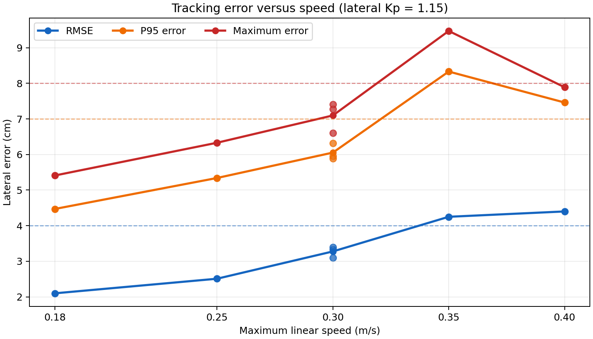
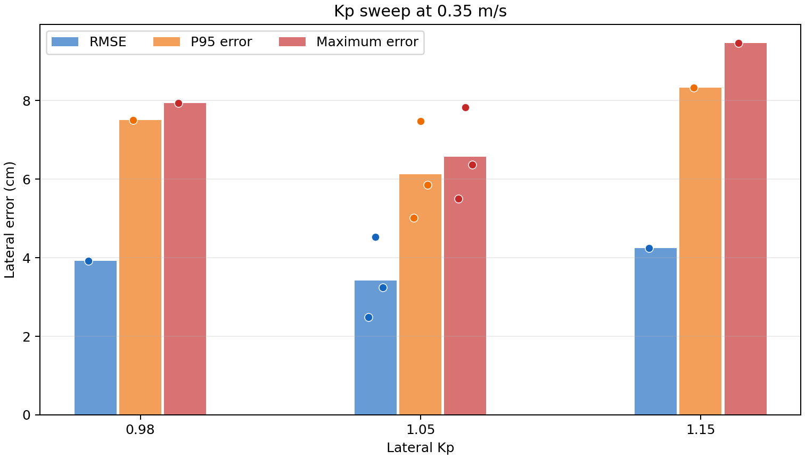
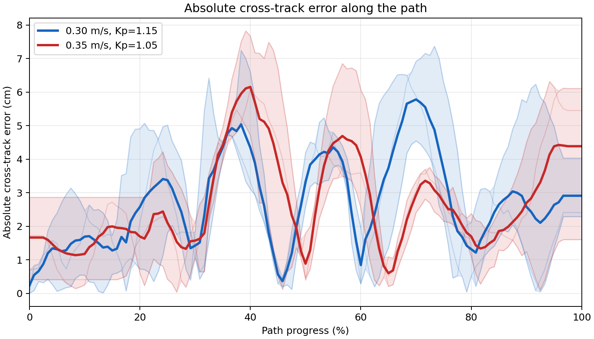

# 室内固定路径 PID 跟踪实验报告

**日期：** 2026-07-24 至 2026-07-25  
**工作空间：** `/home/wheeltec/agribot/agribot_ws`  
**原始数据：** `pid_tracking_results/run_*/`（每次均包含 `tracking_samples.csv`、`report.json` 和 PID 建议文件）

## 1. 目的

验证农业机器人在不依赖玉米行中心线检测的条件下，对固定参考路径的 PID 跟踪能力；确定室内测试路径、控制器参数和速度上限，并为后续 60 cm 玉米行距的田间试验建立可追溯基线。

## 2. 场地、路径与评价方法

### 2.1 场地

- 地砖：3 × 6 块，每块边长 0.60 m；
- 可用区域：1.8 m × 3.6 m；
- 测试路径起点由首次 `/odometry/filtered` 自动锚定，机器人车头沿场地长边布置。

### 2.2 路径版本

早期路径为 3.0 m 的急 S 弯：0.6 m 进入直线 + 1.8 m S 弯（横向 ±0.20 m）+ 0.6 m 退出直线。该路径局部最小转弯半径约 0.3 m，导致高速度下转向饱和，不适合用作 PID 基准。

后续统一采用**缓 S 弯**：

```text
0.30 m 直线进入 + 2.40 m 平滑 S 弯（横向 ±0.10 m）+ 0.30 m 直线退出
```

总弧长约 3.045 m，局部最小转弯半径约 1 m，路径中心至场地长边至少约 0.80 m。

### 2.3 指标

- **RMSE**：横向误差均方根；
- **P95**：95% 采样点的横向误差不超过该值；
- **最大误差**：本次有效跟踪中的最大横向误差；
- **角速度饱和率**：`|angular.z| ≥ 0.95 × max_angular_speed` 的样本比例；
- **换侧次数**：横向误差超过 ±1.5 cm 时的左右换侧计数，只作为摆动提示，不能单独判定不稳定；
- 评估器自首次进入终点容差后排除后续越界样本，避免停车延迟污染 PID 指标。

## 3. 全部实验记录

除特别标记的无效试验外，均使用缓 S 弯路径，`heading_kp=1.20`，且所有 Ki、Kd 为 0。

| ID | 数据目录 | 路径/状态 | 最大速度 m/s | lateral_kp | RMSE cm | P95 cm | 最大误差 cm | 饱和率 | 换侧 | 终点停车 | 结论 |
|---|---|---|---:|---:|---:|---:|---:|---:|---:|---|---|
| E01 | `20260724_231208` | 急 S；终点越界 | 0.18 | 1.00 | 8.63 | 23.26 | 44.51 | 10.07% | 4 | 否 | 无效：终点越界后仍继续行驶，原始误差被放大。 |
| E02 | `20260724_231928` | 未完成/静止 | 0.40 | 1.00 | 1.49 | 1.76 | 2.23 | 0.00% | 0 | 否 | 无效：最大路径进度仅 0.222 m，不能代表路径跟踪。 |
| E03 | `20260724_232126` | 急 S | 0.40 | 1.00 | 9.53 | 16.87 | 19.20 | 62.21% | 3 | 是 | 急弯和高速度导致严重饱和；促成路径改版。 |
| E04 | `20260725_102724` | 缓 S | 0.40 | 1.00 | 4.12 | 7.57 | 9.08 | 5.92% | 3 | 是 | 路径改版有效，但速度过高。 |
| E05 | `20260725_102918` | 缓 S | 0.40 | 1.15 | 4.40 | 7.46 | 7.89 | 5.19% | 2 | 是 | 提高 Kp 后最大误差下降，但速度仍偏高。 |
| E06 | `20260725_103259` | 缓 S | 0.18 | 1.15 | 2.10 | 4.47 | 5.41 | 0.00% | 2 | 是 | 低速基线通过。 |
| E07 | `20260725_103504` | 缓 S | 0.25 | 1.15 | 2.51 | 5.34 | 6.33 | 3.50% | 5 | 是 | 通过。 |
| E08 | `20260725_103625` | 缓 S | 0.30 | 1.15 | 3.40 | 6.32 | 7.41 | 0.44% | 4 | 是 | 通过。 |
| E09 | `20260725_103940` | 缓 S | 0.30 | 1.15 | 3.33 | 5.95 | 6.60 | 7.56% | 5 | 是 | 通过。 |
| E10 | `20260725_104029` | 缓 S | 0.30 | 1.15 | 3.10 | 5.89 | 7.28 | 4.27% | 6 | 是 | 通过。 |
| E11 | `20260725_104852` | 缓 S | 0.35 | 1.15 | 4.25 | 8.33 | 9.47 | 8.95% | 6 | 是 | 不建议继续提速；需优化 Kp。 |
| E12 | `20260725_105331` | 缓 S | 0.35 | 1.05 | 2.49 | 5.02 | 5.50 | 6.54% | 5 | 是 | Kp 对比试验，表现最佳。 |
| E13 | `20260725_105425` | 缓 S | 0.35 | 0.98 | 3.92 | 7.51 | 7.93 | 8.19% | 5 | 是 | Kp 降低过多，误差反增。 |
| E14 | `20260725_105644` | 缓 S | 0.35 | 1.05 | 4.53 | 7.48 | 7.83 | 8.67% | 3 | 是 | 重复试验，可接受但接近上限。 |
| E15 | `20260725_105721` | 缓 S | 0.35 | 1.05 | 3.25 | 5.86 | 6.37 | 2.15% | 3 | 是 | 重复试验，通过。 |

## 4. 关键对比与分析

### 4.1 路径改版的效果

急 S 路径在 0.40 m/s、`lateral_kp=1.00` 时饱和率为 62.21%，最大误差达到 19.20 cm。改为缓 S 路径后，同样 0.40 m/s 下饱和率降至约 5–6%，证明原急 S 路径的曲率对测试结论有显著干扰。

### 4.2 速度扫描（`lateral_kp=1.15`）

| 速度 m/s | 有效次数 | RMSE cm | P95 cm | 最大误差 cm | 结论 |
|---:|---:|---:|---:|---:|---|
| 0.18 | 1 | 2.10 | 4.47 | 5.41 | 最稳定的低速基线。 |
| 0.25 | 1 | 2.51 | 5.34 | 6.33 | 通过。 |
| 0.30 | 3 | 3.10–3.40 | 5.89–6.32 | 6.60–7.41 | 通过且具有重复性。 |
| 0.35 | 1 | 4.25 | 8.33 | 9.47 | 超出室内提速门槛。 |

### 4.3 0.35 m/s 的 lateral_kp 对比

| lateral_kp | 有效次数 | RMSE cm | P95 cm | 最大误差 cm | 结论 |
|---:|---:|---:|---:|---|
| 1.15 | 1 | 4.25 | 8.33 | 9.47 | Kp 偏高，误差与摆动增大。 |
| 1.05 | 3 | 2.49–4.53 | 5.02–7.48 | 5.50–7.83 | 三次均停车成功，是 0.35 m/s 的最佳候选。 |
| 0.98 | 1 | 3.92 | 7.51 | 7.93 | Kp 偏低，控制滞后。 |

`lateral_kp=1.05` 的三次平均值为：RMSE **3.42 cm**、P95 **6.12 cm**、最大误差 **6.57 cm**、角速度饱和率 **5.79%**。

### 4.4 可视化图表

下图直接使用 `pid_tracking_results/` 下的原始 CSV 和 JSON 生成；各速度点的散点表示单次试验，连线或柱形表示同组均值。



*图 1：在 `lateral_kp=1.15` 下，速度升高会增大横向误差；0.35 m/s 时误差明显高于 0.30 m/s。虚线分别是 RMSE 4 cm、P95 7 cm、最大误差 8 cm 的室内参考线。*



*图 2：0.35 m/s 下的 Kp 扫描。`lateral_kp=1.05` 的平均误差最小；1.15 偏高、0.98 偏低。*



*图 3：0.30 m/s 与 0.35 m/s 的重复试验横向误差轨迹。浅色线为单次试验，粗线为同组平均，阴影表示组内范围。*

## 5. 终点停车与测试系统修正

实验期间发现并修正以下问题：

1. 初版控制器仅在距离终点 0.12 m 内停车；横向偏差较大时，机器人可能越过终点横线而不停。现已增加“越过终点横线即停车”判定。
2. PID 计时使用的默认 ROS 时间与系统时间混用，可能触发异常退出。现已在时钟类型不一致时使用首周期 `dt=0.05 s`，避免相减。
3. 同一可执行程序内的障碍检测和 PID 节点曾被强制改为同名，造成参数服务冲突。现已恢复独立节点名 `/obstacle_detector` 与 `/pid_controller`。
4. 评估器现在将 CSV、JSON 和 PID 建议均写入工作空间 `pid_tracking_results/`，人工停止时也会保存已采样数据。

## 6. 当前室内结论与建议参数

### 6.1 推荐室内工作点

| 用途 | 最大速度 m/s | lateral_kp | heading_kp | Ki | Kd |
|---|---:|---:|---:|---:|---:|
| 稳定重复测试 | 0.30 | 1.15 | 1.20 | 0 | 0 |
| 室内上限验证 | 0.35 | 1.05 | 1.20 | 0 | 0 |

现阶段不建议加入 I 或 D：实验中平均有符号横向误差接近零，不存在稳定的单侧偏差；D 项对未滤波误差差分较敏感，当前未观察到必须通过 D 才能抑制的持续蛇形。

### 6.2 下一步

1. 将 0.30 m/s、`lateral_kp=1.15` 作为室内稳定基线；
2. 若继续验证 0.35 m/s，保持 `lateral_kp=1.05`，每次只改变一个变量；
3. 暂不继续提高室内速度；
4. 进入玉米地前，必须测量中心线提取误差和定位误差。

## 7. 60 cm 玉米行距的田间适用性

已知玉米行距 60 cm、机器人最大宽度 25 cm，居中时每侧理论净空为：

```text
(60 − 25) / 2 = 17.5 cm
```

田间安全不应只使用 PID 最大误差，而应满足：

```text
中心线提取误差 + 定位误差 + PID 跟踪误差
≤ 行距 / 2 − 机器人宽度 / 2 − 植株安全间隙
```

若目标植株安全间隙为 10 cm，则总误差预算仅为 7.5 cm。因此室内 0.30–0.35 m/s 的结果只能证明控制器具备潜力，不能直接作为田间速度许可。中心线和定位误差未知时，田间首次建议采用 **0.10–0.15 m/s**，并记录相同指标。

## 8. 数据索引

每项 E01–E15 的原始数据均位于：

```text
pid_tracking_results/run_<表中数据目录>/report.json
pid_tracking_results/run_<表中数据目录>/tracking_samples.csv
pid_tracking_results/run_<表中数据目录>/recommended_pid.yaml
```
