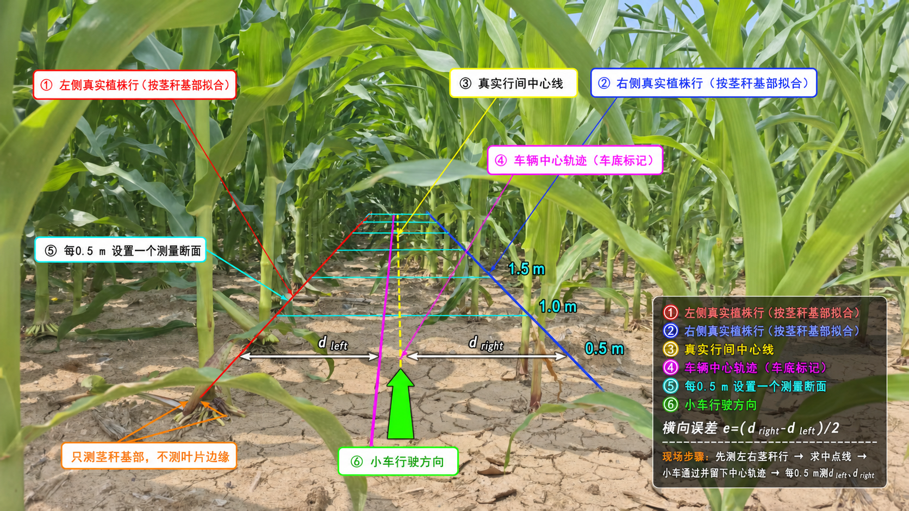

# 玉米冠层下感知质量约束导航小论文真实田间试验指导

版本：2026-07-27（适配当前工程、0.18/0.40 m/s速度上限和0.5 s底盘看门狗）

本文件是正式试验执行依据。到田间后按照“准备—终端1—终端2—终端3—终端4—
运行—停机—验收—测量”的顺序逐项执行，不得凭记忆省略步骤。若本文件与临时
口头安排冲突，以锁定配置、试验台账和本文件为准。

## 1. 试验目的与论文边界

本指导用于验证以下三项论文贡献：

1. 玉米冠层下三维点云内侧双行稳健中心线提取；
2. 融合点云支持、观测完整性、行距一致性、拟合残差和安全裕度的可解释
   感知质量评价；
3. 感知质量约束的自适应行间控制。

正式试验只检验“中心线感知—质量评价—行间控制”闭环。地头自动掉头和障碍
避让不作为本文贡献，也不把掉头试验混入本文的正常/复杂行闭环统计。检测器可继续
记录 `/headland_detected`，但论文正式直线行试验必须将控制器
`enable_headland_turn` 设置为 `false`。

本文不使用“首次”“完全自主”“高精度”等缺少数据支持的表述。控制器内部误差、
轮速里程计和当前融合里程计都不能替代外部真值。

## 2. 待验证假设

正式试验开始前固定以下假设和主要指标，试验后不得根据结果临时更换：

- H1：完整感知方法相对普通双行最小二乘拟合，降低中心线横向误差、航向误差和
  帧间抖动，并提高有效检测率；
- H2：置信度与真实横向误差、真实航向误差显著相关，且能够区分安全和危险
  中心线；
- H3：在缺株、遮挡或杂草复杂行中，质量约束 PID 相对固定速度 PID 降低真实
  横向误差 P95、最大误差、植株接触或人工干预，同时保持可接受的完成率。

主要指标为真实横向误差 P95、最大误差、植株茎秆接触和人工干预。MAE、RMSE、
航向误差、丢线持续时间、完成率和运行时间作为辅助指标。

## 3. 试验总体设计

### 3.1 参数标定组

选择不进入正式统计的正常玉米行完成：

- 点云 ROI、高度范围和体素尺寸摸底；
- 点数、行距、残差、跳变、丢线、置信度和停车阈值确定；
- PID参数、0.18 m/s核心速度和0.40 m/s增强速度的安全性确认；
- 车底轨迹标记装置偏置标定；
- 1 分钟 rosbag 容量和系统负载测试。

参数标定组的数据不得混入正式结果。

### 3.2 正式闭环对照

速度参数必须称为“最大线速度设置”或 `v_max`。质量约束控制会根据置信度、安全
裕度和转向幅度降低实际速度，因此 `max_linear_speed:=0.40` 不等于车辆全程以
0.40 m/s 恒速行驶。论文必须同时报告 `/cmd_vel` 实际平均速度和里程计实际平均
速度。

0.10 m/s 无法稳定克服当前底盘低速死区，不作为正式速度档。试验分为两级：

**最低可发表核心矩阵**：只使用 `v_max=0.18 m/s`，验证本文核心的 fixed/qaware
差异。

| 行况 | 固定速度PID | 质量约束PID | 每组重复 |
|---|---:|---:|---:|
| 正常行 | 0.18 m/s | 0.18 m/s | 至少5次 |
| 复杂行 | 0.18 m/s | 0.18 m/s | 至少5次 |

最低试验量为 `2种行况 × 2种控制 × 1档速度 × 5次 = 20次`。

**推荐增强矩阵**：增加 `v_max=0.40 m/s`，用于说明速度提高后的精度—效率—风险
变化。完整试验量为：

```text
2种行况 × 2种控制 × 2档速度 × 5次 = 40次
```

若0.40 m/s固定速度组在复杂行中经摸底确认具有明显植株损伤风险，应停止该组合，
保留失败及终止记录，并在论文中说明安全原因；不得为了凑齐样本继续进行危险试验。

你在2026-07-27完成的正常行 qaware、v018/v040 各2次，只能在满足“参数已锁定、
存在独立真值、现场事件记录完整”时计入正式数据，否则归入摸底组。两档速度目前
都缺少同速度的 fixed 配对，不能单独证明质量约束控制优于固定速度控制。

正常行用于参数标定后必须另选正式行段；复杂行必须是独立的缺株、遮挡、杂草或
轻度倒伏行段，不能一边测试一边继续调参。

每个 fixed/qaware 配对使用同一行段、同一行驶方向和相同起点。运行顺序采用交替
或随机顺序，避免电池电量、土壤变化和时间变化只作用于某一方法。

“重复5次”优先解释为5个独立行段上的5个配对，而不是在同一条5 m通道反复跑5次。
至少应覆盖3对不同玉米行；若只能使用同一行段，论文必须把它写成重复运行而不是
独立地块重复，并降低泛化性表述。

### 3.3 感知层消融

正式田间原始点云只采集一次，在同一份 rosbag 上离线运行：

1. `ls_baseline`：普通左右行最小二乘；
2. `inner_robust`：内侧行提取和稳健拟合；
3. `parallel_temporal`：增加平行双行及时序约束；
4. `full`：完整方法及质量评价。

四种方法必须使用相同 rosbag、相同起止时间、相同回放速度和同一份外部真值。

### 3.4 精度段和可靠性段分开

- **精度段**：建议20～30 m，车底留下中心轨迹，每0.5 m设置一个测量断面；
  用于真实横向/航向误差、置信度相关性、ROC/PR和闭环精度。
- **可靠性段**：可为200～500 m，不强求全程厘米级真值；用于完成率、接触、
  人工干预、丢线、停车和运行时间。

不能用长距离可靠性数据声称厘米级跟踪精度；也不能用短距离单条平滑轨迹代替
长距离可靠性。

### 3.5 数据与论文结论对应关系

| 要支撑的论文内容 | 必须取得的数据 | 数据来源 | 不能替代它的数据 |
|---|---|---|---|
| 内侧双行中心线更准确 | 四种消融方法的横向/航向误差、有效率、抖动 | 同一rosbag离线回放 + 独立行中心真值 | 控制器内部误差 |
| 质量指标确实代表风险 | 五个原始分量、置信度、真实中心线误差 | `timeseries.csv` + 断面真值 | 只看最终置信度曲线 |
| 质量指标能区分危险 | Spearman、ROC/PR、危险事件召回率 | 独立感知测试组 | 主观评价“看起来可信” |
| qaware比fixed安全 | 配对的P95/最大真实偏差、接触、干预、完成率 | 闭环CSV + 断面真值 + 事件表 | 一条平滑轨迹 |
| 提速后的性能变化 | 实际指令/里程计速度、误差和完成时间 | `/cmd_vel`、`/odometry/filtered`、真值 | 文件名中的v018/v040 |
| 系统可复现 | 代码状态、配置哈希、参数快照、传感器安装尺寸 | 锁定文件 + `metadata.json` + 台账 | 试验后凭记忆补参数 |
| 长距离可用性 | 无干预距离、接触/干预、停车、完成时间 | rosbag + 事件表 + 台账 | 全程厘米级真值的缺失 |

控制器发布的 `controller_lateral_error_m` 是车辆相对“算法自己生成的中心线”的
内部误差，只能用于诊断跟踪器是否跟得上，不能作为真实行间跟踪精度。论文中的
厘米级精度必须来自第6节的独立断面测量。

### 3.6 质量指标验证数据必须单独设计

闭环中的qaware会在低质量时降速或停车，因此正式闭环数据中可能没有足够的
“误差超过安全阈值”样本，导致ROC无法计算。不得为了产生危险样本让自动车辆继续
冲向植株。应另建一个不用于调参的感知验证组：

1. 选择正常、缺株、单侧遮挡、双侧遮挡、杂草和行距变化片段；
2. 车辆保持静止，或由人工遥控/缓慢推行通过，不启动路径跟踪终端；
3. 在多个已测量断面采集原始点云、中心线、五个质量分量和独立真值；
4. 可在安全静止状态下设置不同初始横向位置和航向，增加观测完整性变化；
5. 每类至少覆盖3个独立片段，不把同一片段连续数百帧当作数百个独立重复。

风险事件仍按物理安全阈值 `E_safe` 定义。若独立测试组中依然没有任何超过
`E_safe` 的样本，应如实报告“未观察到物理危险事件，ROC-AUC不可计算”，并将
预先定义的较小预警阈值分析作为补充，不能试验后挑选一个最有利阈值替换
`E_safe`。

## 4. 人员、设备与安全

### 4.1 建议人员

至少3人：

1. 安全员：持急停或遥控器，只负责车辆安全；
2. 计算机操作员：启动节点、rosbag和记录试验编号；
3. 测量记录员：填写田间台账、记录事件、测量断面真值。

安全员不得同时低头操作电脑。任何人员不得站在车辆正前方或车辆即将进入的两行
玉米之间。

### 4.2 必需设备

- 小车、MID360、IMU、硬件急停和遥控接管；
- 卷尺、钢尺、测绳、测量桩、记号牌；
- 可清除的车底中心轨迹标记装置；
- 游标尺或直角尺，用于标定标记点相对车体中心的偏置；
- 备用电池、电压/电量记录工具；
- 现场记录表和防水书写工具；
- 足够容量的存储介质。

每次正式试验前用 `lsblk -f` 和 `df -h` 同时检查U盘与工作空间磁盘。录包脚本
优先选择剩余空间不少于1 GiB的已挂载U盘；U盘不可用时使用工作空间。当前记录
介质不足1 GiB时拒绝启动。长距离原始点云应在当天完成后备份，自动回退只能降低
数据丢失风险，不能替代容量检查。

### 4.3 立即终止条件

出现以下任一情况立即急停并保留数据，不得删除“失败试验”：

- 车辆可能接触茎秆或越出安全通道；
- `/odometry/filtered`、点云或 TF 持续中断；
- 控制指令与实际转向方向相反；
- 车辆连续摆动幅度扩大；
- 人员、工具或其他车辆进入试验区域；
- 电脑磁盘、温度、电量或通信异常。

## 5. 正式试验前参数锁定

### 5.1 实测几何量

使用卷尺更新：

- 车辆最大外廓宽度 `W_vehicle`；
- 每个试验段的平均、最小和最大行距 `W_row`；
- 要求的植株安全间隙 `C_plant`。

逐行段计算危险横向误差阈值：

```text
E_safe = W_row / 2 - W_vehicle / 2 - C_plant
```

若最小行距对应的 `E_safe <= 0`，该行段不具备几何通行条件，不得启动自动行走。
论文应同时报告实测车宽、行距分布、安全间隙和最终阈值。

### 5.2 关闭本文不验证的控制功能

正式直线行试验在
`src/centerline_extraction/config/field_row_follow.yaml` 中确认：

```yaml
enable_headland_turn: false
```

`enable_headland_detection` 可以保持 `true`，用于记录地头候选，但不能驱动车辆
执行换行。

### 5.3 锁定配置和代码状态

在工作空间执行：

```bash
cd /home/wheeltec/agribot/agribot_ws
mkdir -p field_locked_configs

cp src/centerline_extraction/config/field_row_follow.yaml \
  field_locked_configs/field_row_follow_YYYYMMDD_locked.yaml

sha256sum field_locked_configs/field_row_follow_YYYYMMDD_locked.yaml \
  > field_locked_configs/field_row_follow_YYYYMMDD_locked.sha256

git rev-parse HEAD > field_locked_configs/git_commit_YYYYMMDD.txt
git diff > field_locked_configs/uncommitted_patch_YYYYMMDD.diff

colcon build --packages-select turn_on_32chassis centerline_extraction \
  --symlink-install --allow-overriding turn_on_32chassis centerline_extraction
source install/setup.bash
```

正式试验期间不得修改源码和锁定参数。若确实必须修改，从修改后开始建立新的试验
批次，原批次与新批次不得直接合并。

同时锁定底盘看门狗配置：

```bash
cp src/turn_on_32chassis/config/bringup.yaml \
  field_locked_configs/chassis_bringup_YYYYMMDD_locked.yaml

sha256sum field_locked_configs/chassis_bringup_YYYYMMDD_locked.yaml \
  > field_locked_configs/chassis_bringup_YYYYMMDD_locked.sha256
```

当前 `cmd_vel_timeout` 应为 `0.5` s。它用于路径跟踪进程退出或停止发布后直接向
STM32发送零速度，不改变原有中心线丢失停车机制。看门狗只属于安全兜底，不作为
本文算法创新。

## 6. 无冠层上方设备的真值方案



上图用于说明测量对象和操作顺序，线的位置及0.5 m标记是示意，不得按照片像素
换算真实距离。正式试验必须用卷尺、测绳和车底轨迹按以下步骤实测。

### 6.1 车底中心轨迹标记

在车体几何中心投影点安装标记装置。标记点应尽量位于左右轮之间、前后轮轴几何
中心附近，避免安装在车尾形成转弯杠杆误差。

根据地面选择：

- 本文照片所示的干燥裸土：优先使用普通白面粉重力滴粉装置；
- 松软且容易留下痕迹的裸土：可使用细标记轮或轻划线针；
- 水泥、地砖等人工场地：可使用可水洗粗粉笔；
- 秸秆或杂草覆盖：窄幅、明显且不缠绕车轮的标记方式。

#### 推荐的白面粉标记装置

日常材料即可制作：

- 300～500 mL带盖塑料瓶或调料挤压瓶；
- 普通白色小麦面粉；
- 一段内径约3～5 mm的透明软管；
- 小夹子、输液调节夹或小阀门，用于调节和关闭流量；
- 扎带和带弹性的安装支架。

将瓶子竖直固定在车底，软管出口朝下，离地约30～50 mm。出口必须位于车体纵向
中心面，前后方向尽量靠近前后轮轴的几何中点。若安装位置存在横向偏置，试验前
必须用钢尺测量并在真值计算中修正。

正式试验前先在非正式5 m场地进行一次流量测试：

1. 车辆静止时关闭阀门，避免形成面粉堆；
2. 车辆开始运动后打开阀门，使地面形成约5～10 mm宽、能够辨认的细线；
3. 线条只需连续可辨，不得为了醒目大量撒粉；
4. 车辆停车或试验结束立即关闭阀门；
5. 检查软管不会碰到车轮、茎秆、地面或改变车辆运动。

每次运行结束后先完成全部断面测量，再用软扫帚或小耙轻轻清除，下一次运行重新
留下轨迹。不同方法的轨迹不能叠加。面粉应在车辆通过时才释放，禁止提前沿真实
中心线撒粉，以免形成额外人工特征。大风、下雨或地面颜色与面粉反差过低时停止
使用该方法，改用轻划线轮，并在台账记录标记方式。

不要使用石灰、油漆、道路喷漆、滑石粉或大量彩色颜料：这些材料可能污染地块、
产生粉尘或难以彻底清除。操作面粉时也应避免扬尘和吸入。

标记宽度应尽量小，且不能改变轮胎附着条件。每次试验前测量标记点相对车体中心的
横向偏置。建议偏置不超过5 mm；超过时在计算中修正。

标记只允许在车辆经过时形成，不得提前在前方铺设可被激光算法利用的引导线。

### 6.2 建立真实双行中心

在精度试验段每隔0.5 m设置断面。每个断面附近记录左右玉米行茎秆基部位置。
缺株处使用前后相邻多个茎秆进行局部稳健拟合，不能用最近一对茎秆直接定义中点。

设同一断面左、右拟合行点为 `P_left`、`P_right`：

```text
P_center = (P_left + P_right) / 2
```

各断面的 `P_center` 连接后构成真实行间中心线。玉米行弯曲时使用分段直线或平滑
曲线，不能只连接试验段首尾点。

#### 断面真实中点的现场标记

中点标记必须在小车完成该次运行并留下车底轨迹后布置，不能在行驶前把中点、中心
线或横向测绳放在通道内。推荐使用：

- 长约80～120 mm的短竹签或木制高尔夫球钉；
- 顶端缠荧光色胶带；
- 按 `C00、C01、C02……`逐个编号。

用竹签或球钉的尖端代表真实中点坐标，不能用较宽的胶带边缘作为测量点。每个断面
按以下步骤定位：

1. 在局部真实行方向的垂直方向建立该断面；
2. 确定该断面与左、右拟合植株行的交点 `P_left`、`P_right`；
3. 拉直但不拉伸软尺，测得两点间距 `W_row`；
4. 从左交点沿断面量取 `W_row/2`，插入编号中点标记；
5. 再从右交点反向测量，确认到标记尖端的距离同样为 `W_row/2`；
6. 两侧复核结果相差超过10 mm时重新确定植株行和中点。

中点恰好落在面粉车辆轨迹上时，先测量并拍照，再从轨迹旁斜插竹签，使尖端仍落在
中点，不能直接破坏尚未测量的轨迹。所有中点测量结束后清点并拔除全部标记，尤其
不能把金属钉遗留在田间。

### 6.3 试验后断面测量

车辆完成一次单向试验后，立即在每个断面测量：

- 车辆中心轨迹到左拟合行距离 `d_left`；
- 车辆中心轨迹到右拟合行距离 `d_right`；
- 该断面实际行距；
- 车辆中心轨迹点位置。

若只使用左右距离，横向误差绝对值为：

```text
|e_lateral| = |d_left - d_right| / 2
```

统一规定：沿车辆本次行驶方向观察，车辆中心位于真实中心线左侧时
`e_lateral > 0`，位于右侧时 `e_lateral < 0`。更严格时，使用真实中心线法向量
`n`：

```text
e_lateral = n · (P_vehicle - P_center)
```

所有试验必须采用相同的正负号定义。

### 6.4 航向真值

使用车辆轨迹点前后1～2 m范围做局部直线拟合，得到车辆轨迹切线方向
`psi_vehicle`；真实中心线同范围拟合得到 `psi_row`：

```text
e_heading = normalize(psi_vehicle - psi_row)
```

不要只用相邻0.5 m的两个点计算航向，否则1 cm测量误差会被放大为明显角度噪声。

由车辆真值转换为检测器所需的车辆坐标系真实行参数时：

```text
true_row_yaw_deg = -e_heading
true_center_offset_m = -e_lateral / cos(e_heading)
```

角度代入余弦前必须转换为弧度。若使用完整的断面坐标和刚体坐标变换，应优先采用
完整变换；上式用于局部直线近似和符号自检。

### 6.5 人工真值和系统时间对齐

断面真值按距离采集，系统数据按时间记录。短距离内只允许使用里程计确定“何时经过
某个断面”，不得把里程计横向位置当作真值。

推荐步骤：

1. 根据起点、终点实测距离，对 `travel_distance_m` 做线性尺度校正；
2. 找到车辆累计进度最接近每个 `station_m` 的 `timeseries.csv` 行；
3. 将该行的 `time_s`、`ros_time_s` 分别复制到断面表的
   `matched_time_s`、`matched_ros_time_s`；
4. 同时提取对应置信度、质量分量、点数、行距和控制状态；
5. 在断面表每条有效记录中填写该次试验的 `plant_contact`、`intervention`、
   `completed`（均为0或1）；
6. 使用第12.1节工具转换为 `docs/ground_truth_template.csv` 的格式。

每个断面只生成一条时间对齐真值。`time_s` 用于同一次实时闭环记录，
`ros_time_s` 用于将同一真值对齐到rosbag离线消融回放；离线回放时优先使用
`ros_time_s`。测量总数不足时不得通过插值伪造大量独立真值。

为区分两类误差，最终真值表同时填写：

- `lateral_error_m`、`heading_error_deg`：车辆中心轨迹相对真实双行中心的误差，
  用于闭环跟踪评价；
- `true_center_offset_m`、`true_row_yaw_deg`：真实双行中心线在车辆
  `base_footprint` 坐标系中的横向截距和相对航向，用于中心线提取、质量相关性和
  感知消融。

其中 `true_center_offset_m` 规定车辆左侧为正，表示真实中心线在车辆坐标系
`x=0`处的 `y` 值；`true_row_yaw_deg` 规定真实行方向相对车辆前进方向逆时针为正。
符号定义一经开始不得改变。

### 6.6 测量质量控制

- 每次至少随机抽取10%的断面由第二人重复测量；
- 两次横向测量差大于10 mm时重新测量；
- 记录轨迹模糊、被车轮破坏或无法辨认的断面，不得主观补值；
- 每次试验使用新的轨迹颜色或清除上一条轨迹；
- 报告测量工具分辨率和重复测量误差。

## 7. 地块与场景定义

### 7.1 正常行

正式定义应在试验前写入台账，例如：

- 双侧连续植株；
- 无连续大段缺株；
- 杂草不明显高于检测高度范围；
- 无明显倒伏侵入车辆通道；
- 行距处于锁定配置允许范围。

### 7.2 复杂行

按实际存在的退化类型记录，不得只写“复杂”：

- 缺株：缺株总数和最长连续缺株距离；
- 遮挡：叶片侵入通道长度和侧别；
- 杂草：低、中、高等级及覆盖长度；
- 倒伏：侵入通道的侧别和长度；
- 行距突变：最小、最大行距及发生位置。

复杂行只用于独立验证，不能参与正式参数调整。

### 7.3 现场必须人工测量的项目

**每个行段只需测量一次：**

- 行段起止点和实测长度；
- 每个断面的左右茎秆基部坐标或左右距离；
- 平均、最小、最大行距和植株株距；
- 缺株数量、最长连续缺株长度和发生位置；
- 杂草、遮挡、倒伏等级及覆盖长度；
- 坡度和土壤状态；
- 生育期、平均株高；
- 雷达离地高度和安装俯仰角。

**每次运行前测量：**

- 车辆中心相对真实行中心的初始横向偏差；
- 车头相对真实行方向的初始航向偏差；
- 电池电量、载荷、试验编号和计划顺序；
- 车底标记装置横向偏置。

**每次运行中记录：**

- 叶片接触和茎秆接触分别计数；
- 遥控接管、急停、异常停车和传感器中断；
- 每个事件的大致断面位置和系统时间；
- 是否到达预定终点。

**每次运行后测量：**

- 各断面车辆中心轨迹位置；
- 车辆轨迹到左右拟合行的距离；
- 局部车辆航向和真实行航向；
- 终点位置、电池电量和实际运行长度；
- 轨迹不可辨认或测量无效的断面。

自动CSV不能替代这些人工量；人工量也不能替代原始rosbag。

## 8. 现场数据目录与编号

实时数据根目录由程序自动选择。U盘已挂载、可写且剩余空间不少于1 GiB时使用：

```text
/media/wheeltec/U盘卷标/agribot_field_data/
├── field_trial_results/       # 自动CSV和参数快照
└── field_trial_bags/          # 原始rosbag
```

未插U盘、U盘不可写或空间不足时使用当前工作空间：

```text
agribot_ws/
├── field_trial_results/       # 自动CSV和参数快照
├── field_trial_bags/          # 原始rosbag
├── field_ground_truth/        # 断面测量及最终真值
├── field_trial_notes/         # 现场台账和事件记录
└── field_locked_configs/      # 锁定配置、哈希和代码状态
```

地面真值、现场台账和锁定配置体积较小，仍统一放在工作空间。每次启动后必须抄录
终端打印的“田间CSV和参数快照目录”和“rosbag目录”。若U盘在运行中写满或断开：

- CSV在工作空间生成带 `workspace_continued` 后缀的续写目录；
- rosbag异常退出后在工作空间生成带 `continued_after_usb` 后缀的续录目录；
- 一次试验可能分成U盘和工作空间两段，二者必须使用同一 `trial_id` 一并归档。

可通过 `FIELD_USB_MOUNT` 指定U盘，通过 `FIELD_STORAGE_MIN_FREE_GIB` 修改阈值；
设置 `FIELD_STORAGE_FORCE_WORKSPACE=1` 可强制不使用U盘。

试验前执行：

```bash
cd /home/wheeltec/agribot/agribot_ws
mkdir -p field_ground_truth field_trial_notes

cp src/centerline_extraction/docs/field_trial_register_template.csv \
  field_trial_notes/field_trial_register_YYYYMMDD.csv

cp src/centerline_extraction/docs/field_cross_section_truth_template.csv \
  field_ground_truth/cross_section_truth_YYYYMMDD.csv

cp src/centerline_extraction/docs/field_event_log_template.csv \
  field_trial_notes/field_event_log_YYYYMMDD.csv
```

建议编号：

```text
p01_normal_qaware_v018_r1
p01_normal_fixed_v018_r1
p02_complex_qaware_v018_r1
p02_complex_fixed_v018_r1
```

其中：

- `p01/p02`：地块或行段编号；
- `normal/complex`：行况；
- `qaware/fixed`：控制方法；
- `v018`：0.18 m/s；
- `r1～r5`：重复序号。

CSV、rosbag、人工台账和真值必须使用完全相同的 `trial_id`。

建议把5个重复分配到5个配对行段：

```text
n01_normal_fixed_v018_r1    n01_normal_qaware_v018_r1
n02_normal_qaware_v018_r2   n02_normal_fixed_v018_r2
...
c01_complex_fixed_v018_r1   c01_complex_qaware_v018_r1
c02_complex_qaware_v018_r2  c02_complex_fixed_v018_r2
...
```

奇数重复先fixed、偶数重复先qaware，或在试验前使用固定随机种子生成顺序，并把顺序
写入台账的 `planned_order`。不得看完第一次结果后再决定第二种方法是否运行。
v040增强组在同一行段上采用相同原则，但要避免同一行段被前面车辆碾压或扰动后只
影响某一种方法；必要时更换相邻等效行段并记录。

## 9. 现场终端与逐次启动流程

### 9.1 终端职责总表

| 终端 | 何时启动 | 启动内容 | 自动得到的数据 | 支撑的论文内容 |
|---|---|---|---|---|
| 终端1 | 每天一次 | 底盘、传感器、融合里程计、中心线感知 | 点云、里程计、实时中心线和质量指标 | 基础感知与车辆运行 |
| 终端2 | 每次一次 | rosbag原始数据记录 | 可重复回放的原始点云和全部关键话题 | 感知消融、异常追溯 |
| 终端3 | 闭环试验每次一次 | PID跟踪和CSV记录器 | `timeseries.csv`、`metadata.json` | fixed/qaware闭环比较 |
| 终端4 | 每天持续 | 安全状态监控 | 现场可见的状态变化 | 发现丢线、低质量停车和传感器异常 |
| 人工纸表/电子表 | 每次填写 | 台账、断面真值和事件 | 独立真值、接触、干预和完成情况 | 真实精度与可靠性 |

终端1整天保持运行；终端2和终端3每次必须重新启动，以形成独立文件。终端2必须先于
终端3启动，防止漏掉车辆开始运动的前几秒。

### 9.2 终端0：每天开始前准备

```bash
cd /home/wheeltec/agribot/agribot_ws
source install/setup.bash

df -h .
git status --short
sha256sum -c field_locked_configs/field_row_follow_YYYYMMDD_locked.sha256
sha256sum -c field_locked_configs/chassis_bringup_YYYYMMDD_locked.sha256
```

确认当天台账、断面表和事件表已经复制，电脑时间正确，所有人员明确本次
`trial_id`。若当天中途更换代码、配置、雷达安装角度、轮胎或载荷，必须结束当前
批次并重新锁定。

### 9.3 终端1：基础系统和中心线感知

```bash
cd /home/wheeltec/agribot/agribot_ws
source install/setup.bash

ros2 launch centerline_extraction field_system_with_perception.launch.py \
  use_rviz:=false
```

终端1启动后保持不动。另开终端依次检查：

```bash
source /home/wheeltec/agribot/agribot_ws/install/setup.bash

timeout 6 ros2 topic hz /livox/lidar
timeout 6 ros2 topic hz /odometry/filtered
ros2 topic echo /corn_row_center_line --once
ros2 topic echo /corridor_confidence --once
ros2 topic echo /centerline_detection_diagnostics --once
ros2 param get /turn_on_32chassis_node cmd_vel_timeout
```

验收标准：

- 点云和融合里程计持续更新，不是只出现一帧；
- `/corn_row_center_line` 包含非零路径点；
- 置信度及诊断数组持续存在；
- `cmd_vel_timeout` 返回 `0.5`；
- TF没有持续报错；
- 急停和遥控接管有效。

车辆落地前先架空驱动轮确认正线速度、正负角速度、中心线丢失停车和急停。正式
试验当天只做一次，不要每次都用正式数据调参。

### 9.4 终端4：状态监控

```bash
cd /home/wheeltec/agribot/agribot_ws
source install/setup.bash

ros2 topic echo /navigation_safety_state
```

正常跟踪应主要显示 `TRACKING`。可能出现的关键状态包括：

- `WAITING_FOR_CENTERLINE`：没有可用中心线；
- `STOP_STALE_CENTERLINE`：中心线超时；
- `WAITING_FOR_QUALITY`、`STOP_STALE_QUALITY`：质量数据缺失或超时；
- `RECOVERY_HISTORY_PATH`：短时使用历史中心线；
- `STOP_LOW_CONFIDENCE`：低置信度停车；
- `STOP_SAFETY_MARGIN`：安全裕度不足停车。

状态变化不能只靠操作员记忆，rosbag和CSV都会保存；操作员仍需在事件表中记录
发生位置和现场原因。

### 9.5 终端2：每次先启动rosbag

以正常行、qaware、v018、第1次为例：

```bash
cd /home/wheeltec/agribot/agribot_ws
source install/setup.bash

ros2 run centerline_extraction record_field_bag.sh \
  p01_normal_qaware_v018_r1
```

看见“正在等待并记录”后才能启动终端3。脚本记录：

- 原始MID360点云和IMU；
- 轮速、LIO和融合里程计；
- 全局中心线和车辆坐标系局部中心线；
- 左右边界、行距、安全裕度和误差预算；
- 五个质量分量、最终置信度和控制质量因子；
- `/cmd_vel`、控制误差、导航状态、TF、参数事件和ROS日志。

磁盘空间警告不得忽略。终端2中的 `trial_id` 必须和终端3逐字符一致。

### 9.6 终端3：最后启动路径跟踪和CSV记录

车辆会在控制器收到有效中心线后开始运动，因此执行命令前必须满足：

- 车辆已经位于标定起点；
- 起始横向偏差和航向已经测量并填写；
- 安全员已经握住急停/遥控器；
- 车辆前方和两行之间无人；
- 终端2已经开始录包。

qaware示例：

```bash
cd /home/wheeltec/agribot/agribot_ws
source install/setup.bash

ros2 launch centerline_extraction field_path_tracking.launch.py \
  trial_id:=p01_normal_qaware_v018_r1 \
  scenario:=normal \
  quality_aware:=true \
  max_linear_speed:=0.18 \
  max_distance:=0.0 \
  max_time:=600.0 \
  repeat_index:=1
```

对应fixed示例：

```bash
ros2 launch centerline_extraction field_path_tracking.launch.py \
  trial_id:=p01_normal_fixed_v018_r1 \
  scenario:=normal \
  quality_aware:=false \
  max_linear_speed:=0.18 \
  max_distance:=0.0 \
  max_time:=600.0 \
  repeat_index:=1
```

0.40 m/s组只把两处速度标识同步改为：

```text
trial_id中的 v018 改成 v040
max_linear_speed:=0.40
```

复杂行组同时改为：

```text
scenario:=complex
trial_id中的 normal 改成 complex
```

第2～5次必须同时修改：

```text
trial_id末尾 r2～r5
repeat_index:=2～5
```

不能只修改 `trial_id` 而忘记 `repeat_index`。2026-07-27的两个r2记录就存在
`trial_id=r2`、但元数据 `repeat_index=1` 的问题，正式试验必须避免。

fixed与qaware除 `quality_aware` 外，PID增益、感知参数、速度上限、起点、行段、
载荷和行驶方向必须相同。fixed仍保留“中心线无效/过短、中心线超时则停车”的基础
安全机制，但不使用置信度和安全裕度进行自适应调速、历史保持或质量停车。

当前5 m场地使用 `max_distance:=0.0`，由场地终点和计划停机控制结束，不增加距离
限制。真实长距离试验也可以保持0，但终点后必须预留至少：

```text
0.5 × max_linear_speed + 实测机械制动余量
```

的安全空段，因为路径跟踪终端异常退出后底盘看门狗最迟约0.5 s发送零速度。

`max_time` 应大于：

```text
试验段长度 / 预期最低实际速度 × 1.3
```

长距离可靠性试验必须提高 `max_time`，不能把时间上限停车误记为算法失败。

### 9.7 启动后立即核对

车辆开始后由计算机操作员快速检查一次：

```bash
ros2 topic info /cmd_vel --verbose
```

正常情况下自动试验只能有一个主动速度发布者 `/pid_controller`。若发现未知速度
发布者，立即停止本次试验。随后观察终端3是否打印CSV目录，确认目录名包含正确的
`trial_id`。

### 9.8 正常结束顺序

1. 车辆到达预定终点，操作员在终端3按 `Ctrl+C`；
2. 安全员持续观察；车辆应在约0.5 s内由底盘看门狗停止；
3. 若未及时停止，立即使用遥控/硬件急停并记为异常；
4. 保持终端2继续录制至少1 s，使 `/rosout` 记录看门狗超时状态；
5. 确认终端3已经写完 `metadata.json`；
6. 在终端2按 `Ctrl+C`，等待rosbag压缩和元数据关闭；
7. 将正常的计划终点停止记为 `planned_end_stop`，不计为人工干预；
8. 填写完成、接触、干预、异常和终止原因；
9. 立即测量车底轨迹断面；
10. 完成第11节数据验收后才能开始下一次。

底盘看门狗的零速度直接通过串口发给STM32，不一定在 `/cmd_vel` 中出现一条新的
零速度消息；其证据是终端1/`/rosout` 的超时日志和车辆里程计停止。论文只把它写成
安全措施，不写成质量控制结果。

### 9.9 紧急结束顺序

发生危险时不执行“先按Ctrl+C”的正常流程：

1. 安全员先按硬件急停或遥控接管；
2. 操作员停止终端3；
3. 保持rosbag再记录现场状态5～10 s；
4. 停止终端2；
5. 在事件表填写 `emergency_stop` 或 `intervention`、位置和原因；
6. 数据作为失败样本保留，不得删除或重新编号覆盖。

### 9.10 独立感知质量验证组的启动方法

这一组用于H1/H2，不评价控制器，因此**不启动终端3**
`field_path_tracking.launch.py`，也不得让其他节点向 `/cmd_vel` 发布速度。

1. 终端1保持基础系统和中心线感知运行；
2. 关闭电机输出或确认急停，人工把车辆放到预先测量的正常、缺株、遮挡、杂草等
   断面；
3. 用车体几何中心标记和车体纵向基准，测量真实中心线相对车辆的横向偏移和航向；
4. 终端2使用唯一编号开始录包，例如：

```bash
ros2 run centerline_extraction record_field_bag.sh \
  qv01_complex_static_offset_left_r1
```

5. 每个固定姿态保持10～15 s，并在断面表填写断面编号、测量值及
   `date +%s.%N` 得到的时间；
6. 若需换姿态，先停止rosbag，再由人工移动小车；每个姿态单独建bag和
   `trial_id`，避免移动过程被误作正式样本；
7. 回到实验室后按第12.2节对每个bag运行四种感知方法，自动生成
   `timeseries.csv`。

建议至少包括：中心附近、向左偏置、向右偏置、小正航向、小负航向，以及单侧缺株、
单侧遮挡、双侧稀疏、明显杂草等状态。偏置量不得使车辆外廓进入
`E_safe`以外的危险区域；车辆静止且电机禁用时才允许布置人工遮挡。禁止把同一固定
姿态的数百帧当作数百个独立重复，统计时每个姿态、每个断面只取一条对齐真值。
静态组没有实时闭环CSV时，将上述系统时间填入 `matched_ros_time_s`，
`matched_time_s` 可以留空，转换工具会使用ROS时间占位；离线分析仍以
`matched_ros_time_s` 对齐。

## 10. 现场人工事件记录

所有失败、接触和人工操作都要记录，不能只在试验结束后凭记忆补写。

事件类型统一为：

- `leaf_contact`：叶片轻触；
- `stalk_contact`：茎秆接触；
- `intervention`：遥控或人工接管；
- `emergency_stop`：急停；
- `line_lost_stop`：丢线停车；
- `false_headland`：未到真实地头却发布地头信号；
- `sensor_dropout`：点云、IMU、里程计或TF中断；
- `planned_end_stop`：按试验计划在预定终点结束，不计为干预；
- `other`：其他异常，必须说明。

事件发生时记录系统时间：

```bash
date +%s.%N
```

后续用该时间与 `timeseries.csv` 的 `ros_time_s` 对齐。

## 11. 每次试验的数据验收

### 11.1 rosbag

```bash
ros2 bag info "终端打印的rosbag实际目录"
```

至少确认：

- `/livox/lidar` 消息数不为0；
- `/odometry/filtered` 连续；
- `/corn_row_center_line`、`/corn_row_center_line_viz` 和质量诊断存在；
- qaware/fixed均记录到 `/cmd_vel`；
- 数据持续时间覆盖完整试验。

### 11.2 CSV和参数快照

```bash
export TRIAL_RESULT_DIR="终端打印的本次CSV实际目录"
ls -lh "$TRIAL_RESULT_DIR"
head -n 2 "$TRIAL_RESULT_DIR/timeseries.csv"
python3 -m json.tool \
  "$TRIAL_RESULT_DIR/metadata.json" > /dev/null
```

确认 `timeseries.csv` 有数据，`metadata.json` 内包含 controller 和 detector 参数
快照，且 `trial_id`、`scenario`、`quality_aware`、`repeat_index`正确。CSV中的
`local_path_first_*`、`local_path_mid_*` 和 `local_path_last_*` 不能全为空，否则
该次数据不能用于中心线感知误差与消融统计。

### 11.3 无效数据判定

以下情况必须标记，不能悄悄删除：

- 原始点云缺失：不能用于感知消融，但可视情况保留闭环安全事件；
- 外部真值缺失：不能用于精度和置信度有效性分析；
- 参数与锁定配置不一致：不能与主批次合并；
- 人工接管：按失败或干预计入完成率，不得当作正常完成；
- 车辆碰撞：必须计入安全指标，不得因轨迹不好看而剔除。

剔除规则必须在看正式结果之前写明。

## 12. 离线数据处理

### 12.1 断面真值转换

断面表填写完后直接执行：

```bash
cd /home/wheeltec/agribot/agribot_ws
source install/setup.bash

ros2 run centerline_extraction prepare_ground_truth.py \
  --cross-sections field_ground_truth/cross_section_truth_YYYYMMDD.csv \
  --output field_ground_truth/ground_truth.csv
```

脚本只转换 `valid` 不为0且 `trial_id` 非空的断面，发现时间或误差字段为空会指出
具体行号并停止，不会悄悄补值。若断面表未手工填写车辆坐标系真值，脚本按第6.4节
局部直线关系自动计算。输出格式为：

```csv
trial_id,time_s,ros_time_s,lateral_error_m,heading_error_deg,true_center_offset_m,true_row_yaw_deg,plant_contact,intervention,completed
```

同一 `trial_id` 的接触、干预和完成状态应与现场台账一致。统计脚本对每个断面只
匹配最近的一条系统记录，不会把同一断面附近的多帧伪装成多个独立真值样本。

- 感知消融与质量有效性使用 `true_center_offset_m`、
  `true_row_yaw_deg` 和记录器新增的 `local_path_*` 字段计算；
- 闭环跟踪使用 `lateral_error_m`、`heading_error_deg`；
- 感知MAE、P95和质量相关性每个真值断面只取一条；有效检测率和帧间抖动使用
  对应消融CSV的整段全部帧；
- 两者不得互换。

### 12.2 感知消融

感知消融在回到实验室后进行。先停止所有实车基础系统和路径控制，避免新检测器
误发路径给实车。对同一rosbag依次运行四种方法。

每种方法都使用两个终端：

- 离线终端A：启动该方法的检测器和记录器；
- 离线终端B：只回放原始点云、里程计和TF。

禁止直接执行不带 `--topics` 的全话题回放，否则bag中原来记录的中心线会与新算法
生成的中心线同时发布，污染消融结果。

先设置bag路径：

```bash
cd /home/wheeltec/agribot/agribot_ws
source install/setup.bash

export FIELD_BAG="终端打印的rosbag实际目录"
```

#### 方法1：普通左右行最小二乘

离线终端A：

```bash
ros2 launch centerline_extraction perception_ablation.launch.py \
  trial_id:=p02_complex_qaware_v018_r1 \
  scenario:=complex \
  perception_method:=ls_baseline \
  enable_innermost:=false \
  enable_robust:=false \
  use_parallel:=false \
  enable_temporal:=false \
  enable_quality:=false
```

离线终端B：

```bash
ros2 bag play "$FIELD_BAG" --clock --rate 1.0 \
  --topics /livox/lidar /odometry/filtered /tf /tf_static
```

播放结束后在终端A按 `Ctrl+C`。

#### 方法2：内侧行提取和稳健拟合

```bash
ros2 launch centerline_extraction perception_ablation.launch.py \
  trial_id:=p02_complex_qaware_v018_r1 \
  scenario:=complex \
  perception_method:=inner_robust \
  enable_innermost:=true \
  enable_robust:=true \
  use_parallel:=false \
  enable_temporal:=false \
  enable_quality:=false
```

另一个终端执行完全相同的受限 `ros2 bag play`，播放结束后停止终端A。

#### 方法3：增加平行双行及时序约束

```bash
ros2 launch centerline_extraction perception_ablation.launch.py \
  trial_id:=p02_complex_qaware_v018_r1 \
  scenario:=complex \
  perception_method:=parallel_temporal \
  enable_innermost:=true \
  enable_robust:=true \
  use_parallel:=true \
  enable_temporal:=true \
  enable_quality:=false
```

#### 方法4：完整方法和质量评价

```bash
ros2 launch centerline_extraction perception_ablation.launch.py \
  trial_id:=p02_complex_qaware_v018_r1 \
  scenario:=complex \
  perception_method:=full \
  enable_innermost:=true \
  enable_robust:=true \
  use_parallel:=true \
  enable_temporal:=true \
  enable_quality:=true
```

四次回放必须使用相同bag、相同 `trial_id`、相同 `--rate` 和相同话题列表。每次
完成后检查对应CSV的 `perception_method` 和 `local_path_*` 字段，不能修改其他
检测参数。建议至少对3个正常独立片段和3个复杂独立片段执行消融，而不是只选一个
效果最好的bag。

### 12.3 统计分析

根据实测几何量重新计算 `safe-threshold`：

```bash
ros2 run centerline_extraction analyze_field_trials.py \
  --trials field_trial_results \
  --ground-truth field_ground_truth/ground_truth.csv \
  --safe-threshold 实测安全阈值 \
  --output field_analysis_report.json
```

报告至少包含：

- 感知：横向MAE、RMSE、P95、最大误差、航向误差、有效检测率、帧间抖动；
- 质量：Spearman相关、ROC-AUC、平均精确率、高中低置信区间误差；
- 敏感性：五个权重分别 ±20%；
- 闭环：P95、最大误差、完成率、接触、干预、丢线持续时间、运行时间。

每组只有5次时，必须同时给出每次原始结果和效应方向，不能只报告均值或只挑最好
的一次。建议同时报告中位数、四分位数和配对差值；若做显著性检验，应说明样本量
较小的限制。

## 13. 建议论文图表

### 表格

1. 车辆、传感器、行距和安全阈值；
2. 锁定感知与控制参数；
3. 正常/复杂地块条件；
4. 四种感知消融结果；
5. fixed/qaware闭环对照；
6. 接触、干预、丢线和完成率。

### 图

1. 真实玉米地和传感器安装；
2. 车底轨迹标记及断面测量示意；
3. 点云内侧双行和中心线；
4. 四种方法误差箱线图或累积分布；
5. 置信度与真实误差散点图；
6. ROC或PR曲线；
7. fixed/qaware在复杂行中的P95、最大误差和安全事件；
8. 典型退化片段的质量分量、速度、误差和停车状态时间序列。

不得只展示一条看起来平滑的轨迹作为算法有效证据。

## 14. 每日结束检查

每天结束后：

1. 对照台账核对每个 `trial_id` 是否同时存在CSV、metadata、rosbag和人工记录；
2. 检查rosbag消息数量；
3. 复制数据到另一块存储介质；
4. 保存锁定配置、哈希、代码提交和未提交补丁；
5. 只做数据完整性检查，不根据正式结果继续调参；
6. 将异常写入当天记录，禁止第二天凭记忆补写。

## 15. 现场单次试验核对清单

### 启动前

- [ ] `trial_id`、行段、方法、重复编号正确；
- [ ] 实测行距满足几何安全要求；
- [ ] 车体、标记装置、传感器安装牢固；
- [ ] 急停和遥控接管有效；
- [ ] 点云、里程计、TF、中心线和质量指标正常；
- [ ] 磁盘、电量和温度正常；
- [ ] 正式直线试验已关闭自动掉头；
- [ ] rosbag已开始记录；
- [ ] 车辆初始位置和航向已记录。

### 运行中

- [ ] 安全员持续观察车辆；
- [ ] 接触、接管、停车和传感器异常实时记录；
- [ ] 不因结果不好中途修改参数；
- [ ] 不覆盖或删除失败试验。

### 结束后

- [ ] 先停止控制器，再停止rosbag；
- [ ] CSV、metadata和rosbag完整；
- [ ] 完成、接触和干预已经填写；
- [ ] 断面轨迹已经测量；
- [ ] 数据已经备份；
- [ ] 下一次试验使用新的唯一 `trial_id`。
