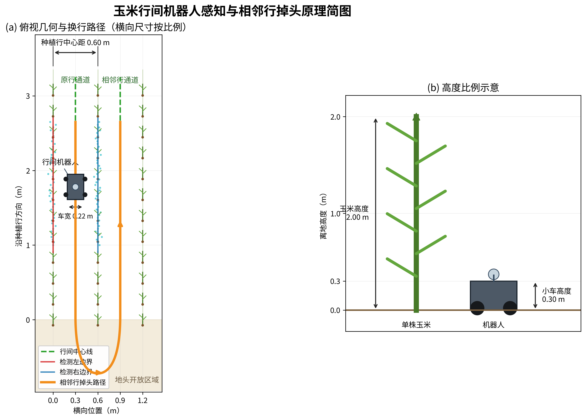
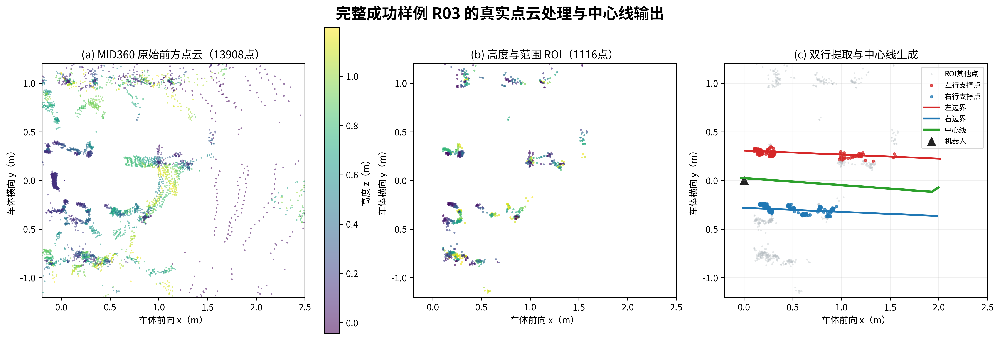
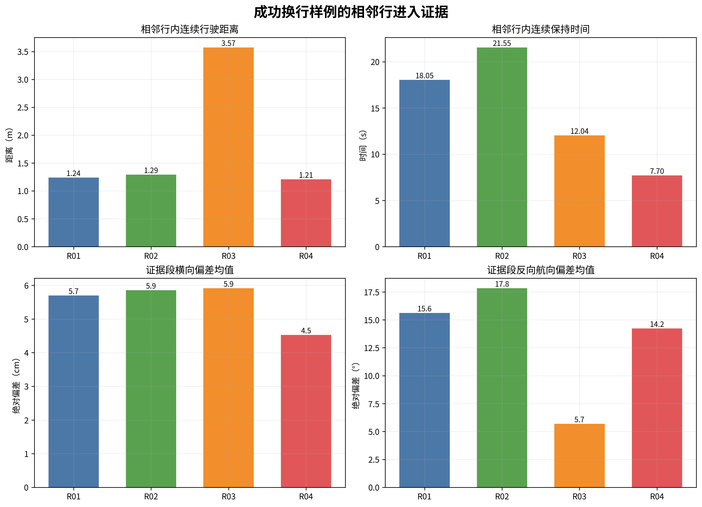
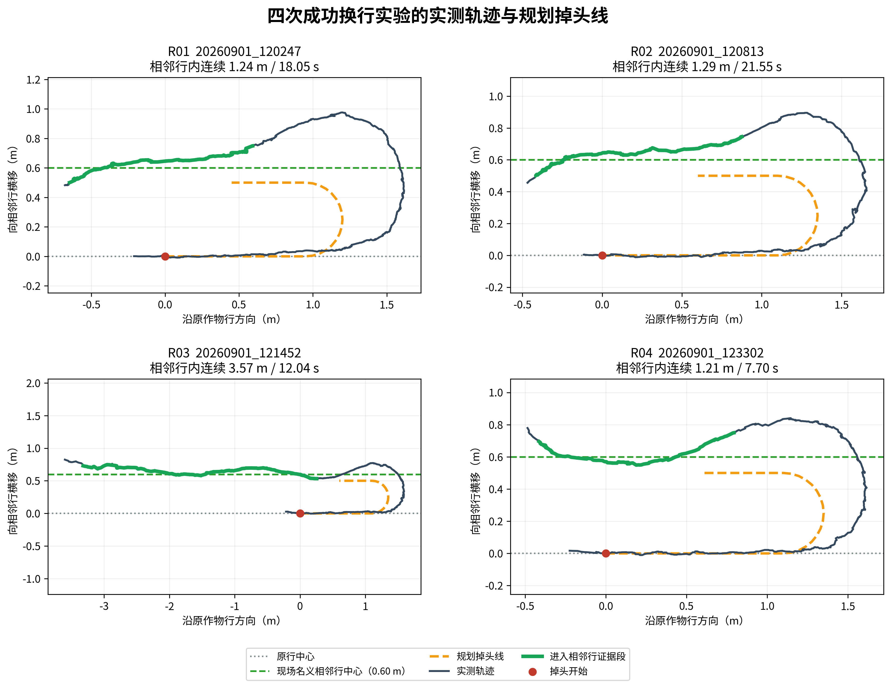
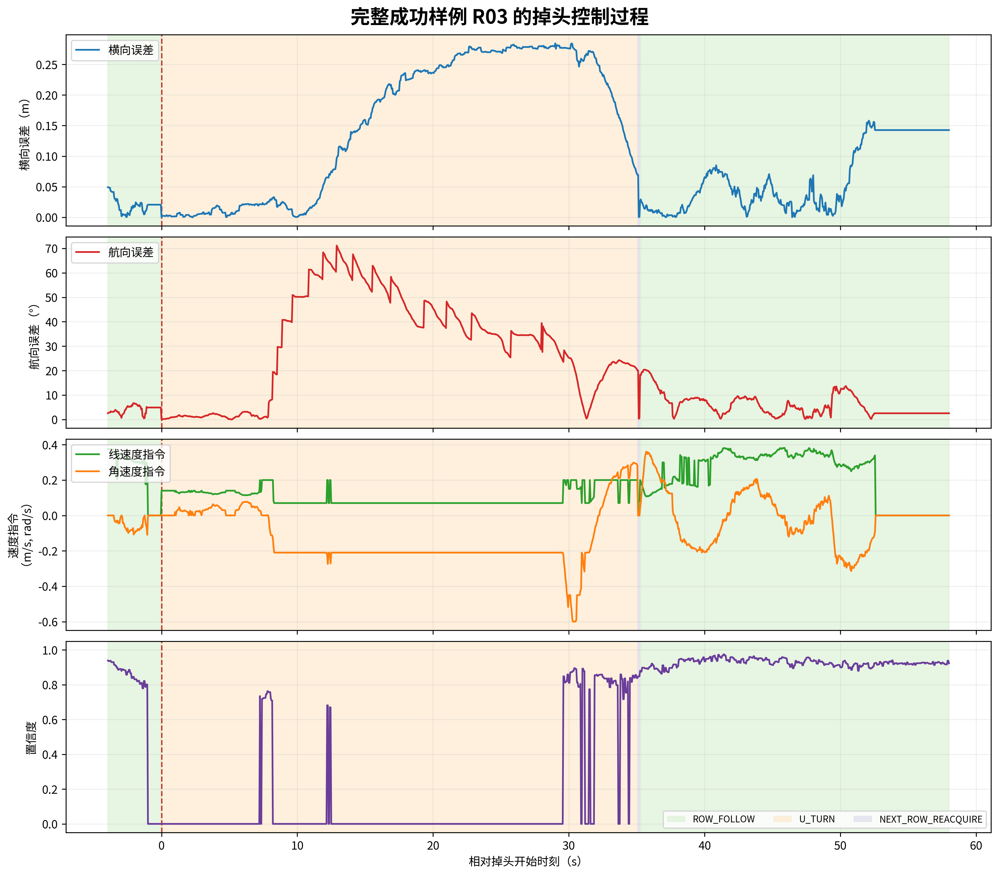

# X.X 基于状态机与几何路径跟踪的地头掉头方法及试验验证

为使行间移动机器人能够由当前作物行连续转移至相邻作物行，本文在玉米行中心线检测与质量感知路径跟踪的基础上，设计了一种基于有限状态机的地头 U 形换行方法。该方法不依赖地头区域持续存在作物行点云，而是利用进入地头前的机器人位姿和设定换行距离生成全局参考路径；完成 180°转向后，再通过预测中心线与实测中心线融合实现相邻行重捕获。系统的整体状态转换过程为

\[
\mathrm{ROW\_FOLLOW}
\rightarrow \mathrm{U\_TURN}
\rightarrow \mathrm{NEXT\_ROW\_REACQUIRE}
\rightarrow \mathrm{ROW\_FOLLOW}.
\]

## X.X.1 掉头状态机设计

在 `ROW_FOLLOW` 状态下，机器人利用 MID360 激光雷达点云提取左右玉米植株行，并以两侧边界的中线作为跟踪路径。地头检测节点综合中心线路径点数、左右作物行支撑点数和检测置信度判断当前帧是否为地头候选；候选状态连续达到设定帧数后发布地头信号。为避免行间局部缺株或短时点云失效造成误触发，控制器还要求机器人自上一次换行后已完成不小于设定值的行间行驶距离，并检查允许掉头次数是否尚未达到上限。只有上述条件同时满足，系统才由 `ROW_FOLLOW` 切换至 `U_TURN`。

进入 `U_TURN` 状态后，控制器记录当前位姿

\[
\boldsymbol{p}_0=[x_0,y_0]^\mathrm{T},\qquad \psi_0,
\]

并以当前航向建立前向单位向量和左法向单位向量

\[
\boldsymbol{t}=
\begin{bmatrix}\cos\psi_0\\ \sin\psi_0\end{bmatrix},
\qquad
\boldsymbol{n}=
\begin{bmatrix}-\sin\psi_0\\ \cos\psi_0\end{bmatrix}.
\]

设掉头方向变量为 \(s\)，左转时 \(s=1\)，右转时 \(s=-1\)。控制器根据几何参考路径进行闭环跟踪，而不是直接施加固定角速度。当机器人与掉头路径终点的距离以及与目标反向航向的误差同时满足

\[
\lVert\boldsymbol{p}-\boldsymbol{p}_{g}\rVert_2\leq \varepsilon_p,
\qquad
\left|\operatorname{wrap}(\psi-\psi_g)\right|\leq \varepsilon_\psi
\]

时，认为几何掉头完成，并进入 `NEXT_ROW_REACQUIRE` 状态。其中，目标航向为 \(\psi_g=\operatorname{wrap}(\psi_0+s\pi)\)，\(\varepsilon_p\) 和 \(\varepsilon_\psi\) 分别为位置和航向容差。

## X.X.2 U 形换行路径生成

试验采用“直行驶出—半圆换行—反向稳定”三段式 U 形路径。第一段使机器人在检测到地头后继续沿原作物行方向驶出距离 \(L_e\)，其路径可表示为

\[
\boldsymbol{p}_1(d)=\boldsymbol{p}_0+d\boldsymbol{t},
\qquad 0\leq d\leq L_e.
\]

直行驶出段的终点记为 \(\boldsymbol{p}_s=\boldsymbol{p}_0+L_e\boldsymbol{t}\)。第二段为半径 \(R\) 的半圆路径：

\[
\boldsymbol{p}_2(\phi)=
\boldsymbol{p}_s+sR\boldsymbol{n}(1-\cos\phi)
+R\boldsymbol{t}\sin\phi,
\qquad 0\leq\phi\leq\pi,
\]

对应路径航向为

\[
\psi_2(\phi)=\operatorname{wrap}(\psi_0+s\phi).
\]

由该式可知，半圆结束时机器人航向改变 180°，理论横向位移为 \(2R\)。当用户不单独指定转弯半径时，程序按照规划换行距离 \(D_p\) 自动设置

\[
R=\frac{D_p}{2}.
\]

半圆末端为 \(\boldsymbol{p}_e=\boldsymbol{p}_s+2sR\boldsymbol{n}\)。第三段沿原前向方向的反方向继续行驶稳定距离 \(L_s\)：

\[
\boldsymbol{p}_3(d)=\boldsymbol{p}_e-d\boldsymbol{t},
\qquad 0<d\leq L_s.
\]

路径以 `headland_path_step` 指定的空间间隔进行离散，并发布至 `/headland_turn_path`。参数 \(L_e\) 决定机器人在开始转向前向地头驶出的距离，\(D_p\) 决定目标横移量，\(L_s\) 用于在进入相邻行前建立反向直线段。程序同时保留连续曲率换行曲线选项，但本次实地成功样例使用标准半圆路径。

**图 X-X 玉米行间机器人相邻行掉头几何原理**

## X.X.3 掉头路径跟踪与相邻行重捕获

在 `ROW_FOLLOW`、`U_TURN` 和 `NEXT_ROW_REACQUIRE` 三种状态下，控制器均采用统一的路径跟踪框架，但分别使用行间中心线、U 形掉头路径和重捕获参考路径。首先在当前参考路径上寻找距离机器人最近的离散点，再沿路径累计长度选取前视距离 \(L_d\) 处的目标点。正常行间跟踪与掉头阶段可分别设置前视距离，避免使用单一参数同时约束直线跟踪精度和弯道响应速度。

横向误差 \(e_y\) 定义为机器人位置到最近路径线段投影点的有符号垂直距离，航向误差 \(e_\psi\) 定义为前视目标点处的路径切线方向与当前车体航向之差。角速度控制量由横向 PID 和航向 PID 共同给出：

\[
\omega^*=K_{py}e_y+K_{iy}\int e_y\,\mathrm{d}t
+K_{dy}\frac{\mathrm{d}e_y}{\mathrm{d}t}
+K_{p\psi}e_\psi+K_{i\psi}\int e_\psi\,\mathrm{d}t
+K_{d\psi}\frac{\mathrm{d}e_\psi}{\mathrm{d}t}.
\]

随后对 \(\omega^*\) 依次施加角速度限幅、小指令死区和角加速度约束，以降低离散路径点和里程计噪声造成的转向突变。线速度由最大速度、感知置信度因子、安全裕度因子和转向因子共同调节：

\[
v=\min\left(v_{\max}f_c f_s f_t,\;v_{\mathrm{mode}}\right),
\]

式中，\(f_c\) 为中心线置信度因子，\(f_s\) 为通道安全裕度因子，\(v_{\mathrm{mode}}\) 为当前状态的速度上限；转向因子 \(f_t\) 随角速度绝对值增大而减小，从而在曲率较大时主动降低线速度。实地试验所用横向 PID 参数为 \(K_{py}=1.0\)、\(K_{iy}=0\)、\(K_{dy}=0.1\)，航向 PID 参数为 \(K_{p\psi}=1.0\)、\(K_{i\psi}=0\)、\(K_{d\psi}=0\)，角速度上限为 0.60 rad/s，角加速度上限为 0.80 rad/s\(^2\)。

几何掉头完成后，控制器按照当前反向航向生成长度为 \(L_r\) 的预测中心线，以避免刚进入下一行、点云尚未形成稳定双行结构时失去参考路径。当检测器重新输出相邻行实测中心线后，根据通道置信度 \(C\) 计算实测路径权重

\[
\alpha=\operatorname{clip}\left(
\frac{C-C_{\mathrm{track}}}
{C_{\mathrm{confirm}}-C_{\mathrm{track}}},0,1\right),
\]

并对预测路径 \(\boldsymbol{p}_{\mathrm{pred},i}\) 与实测路径 \(\boldsymbol{p}_{\mathrm{meas},i}\) 进行逐点融合：

\[
\boldsymbol{p}_{r,i}=(1-\alpha)\boldsymbol{p}_{\mathrm{pred},i}
+\alpha\boldsymbol{p}_{\mathrm{meas},i}.
\]

当实测中心线置信度连续若干帧不低于确认阈值后，控制器清除预测路径并重新进入 `ROW_FOLLOW`。若搜索距离或搜索时间超过上限仍未完成重捕获，则系统停车，防止机器人在无可靠中心线约束的情况下继续行驶。

## X.X.4 实地试验方案

试验在成熟玉米田中进行，玉米高度约为 2.00 m，现场名义种植行中心距约为 0.60 m；机器人宽度约为 0.22 m、高度约为 0.30 m。试验系统使用三个终端窗口分别启动底盘与玉米行检测、记录 rosbag、启动路径跟踪控制器和试验数据记录节点。记录内容包括原始 MID360 点云、里程计、坐标变换、左右作物行边界、局部中心线、检测置信度、地头信号、规划掉头路径、重捕获参考路径、导航状态、控制误差及速度指令。

本节选取 4 次已经由实测轨迹确认进入相邻作物行的右转样例进行分析。4 次试验的行间名义速度上限均为 0.40 m/s。rosbag 中记录的规划横移参数为 0.50 m，对应自动计算的半圆半径为 0.25 m；R01 的直行驶出段约为 0.95 m，R02～R04 约为 1.10 m，反向稳定段均约为 0.50 m。需要指出的是，0.50 m 是控制器使用的规划横移量，现场名义种植行距为 0.60 m，二者不能作为同一物理量混写。

按照实地观察中“完成掉头并进入下一行即判为成功”的原则，本文将该标准量化为：机器人横向位置进入现场相邻行中心线 ±0.15 m 范围，车体相对相邻行反向航向的误差不大于 35°，并形成连续行驶轨迹。该判据用于从记录的里程计轨迹中自动提取相邻行进入证据段。

**图 X-X 真实玉米田点云处理、双行边界提取与中心线生成结果**

## X.X.5 试验结果与分析

表 X-X 给出了 4 次成功换行样例的轨迹分析结果。实测进入横移表示证据段内机器人相对原作物行中心的平均横向位移；横向误差和航向误差分别相对现场 0.60 m 相邻行中心及反向行方向计算。

**表 X-X 成功换行样例的相邻行进入结果**

| 样例 | 实测进入横移/m | 连续距离/m | 连续时间/s | 横向 MAE/cm | 反向航向 MAE/° | 掉头前中心线有效率/% | 完整状态闭环 |
|---|---:|---:|---:|---:|---:|---:|---|
| R01 | 0.620 | 1.239 | 18.05 | 5.70 | 15.62 | 84.13 | 否 |
| R02 | 0.616 | 1.291 | 21.55 | 5.85 | 17.84 | 69.23 | 否 |
| R03 | 0.649 | 3.574 | 12.04 | 5.92 | 5.69 | 74.68 | 是 |
| R04 | 0.615 | 1.208 | 7.70 | 4.53 | 14.23 | 83.21 | 否 |
| 均值±标准差 | 0.625±0.016 | 1.828±1.164 | 14.84±6.17 | 5.50±0.65 | 13.35±5.31 | 77.81±7.13 | — |

**图 X-X 成功换行样例的相邻行进入轨迹指标**

4 次样例均形成了位于相邻行附近且航向反转的连续行驶轨迹，实测进入横移均值为 0.625±0.016 m，与现场 0.60 m 名义种植行距接近。相邻行证据段的横向绝对误差均值为 0.055±0.007 m，反向航向绝对误差均值为 13.35±5.31°。掉头前行间跟踪阶段的中心线有效率为 77.81%±7.13%，横向跟踪误差 MAE 为 0.024±0.005 m，表明机器人在触发地头状态前能够沿当前玉米行保持较小的横向偏差。

图 X-X 对比了 4 次试验的实测轨迹、规划 U 形路径和现场名义相邻行中心。尽管实车轨迹受轮胎侧滑、地面不平整以及底盘最小转弯能力影响，没有与离散半圆路径完全重合，但轨迹均完成横向换行并在反向航向上进入相邻通道。其中，R03 的相邻行证据段最长，且航向误差最小。

**图 X-X 四次成功换行试验的规划路径与实测轨迹**

R03 是本组试验中完成全部导航状态转换的代表性样例。其 `U_TURN` 状态持续 35.05 s，里程计累计运动距离为 4.34 m，掉头阶段线速度指令均值为 0.103 m/s、最大值为 0.20 m/s，角速度指令绝对值最大为 0.60 rad/s。到达掉头终点后，系统进入 `NEXT_ROW_REACQUIRE`，经过约 0.15 s 和 0.032 m 的过渡即恢复 `ROW_FOLLOW`。恢复行间跟踪后，在非零前进指令阶段继续行驶 5.445 m、持续 17.248 s，该阶段横向误差 MAE 为 0.041 m，P95 为 0.136 m。导航模式、误差、控制指令和置信度的时间变化如图 X-X 所示。

**图 X-X 完整成功样例 R03 的导航状态与控制响应**

R01、R02 和 R04 的轨迹已经满足本文定义的物理换行成功条件，但日志中的状态仍停留在 `U_TURN`，未完成 `NEXT_ROW_REACQUIRE` 至 `ROW_FOLLOW` 的闭环切换。这说明几何路径跟踪已经使机器人进入相邻作物行，但掉头终点位置与航向的联合判定对里程计误差、路径跟踪偏差和底盘侧滑较敏感。因而，本组结果可用于证明当前系统具备真实环境下的相邻行换行能力，其中 R03 提供完整自主闭环证据；其余 3 次应作为物理进入相邻行的补充样例，而不应表述为完整状态机闭环均成功。

## X.X.6 本节小结

本节面向玉米行间机器人连续多行作业需求，构建了由行间跟踪、几何 U 形掉头和相邻行重捕获组成的状态机控制方法。控制器利用地头触发时刻的位姿生成直行驶出、半圆横移和反向稳定三段式参考路径，通过横向—航向双 PID、独立掉头前视距离、速度约束和角加速度限制实现路径跟踪，并在掉头结束后融合预测中心线与实测中心线完成导航参考的平滑切换。实地试验中，4 次右转样例均完成了从原通道到相邻通道的物理换行，实测进入横移均值为 0.625 m；其中 R03 完整恢复行间跟踪并继续自主行驶 5.445 m。试验结果验证了所设计方法在真实玉米田环境中的可行性，同时也表明掉头终点判定和相邻行重捕获的稳定性仍是后续需要进一步提高的环节。
